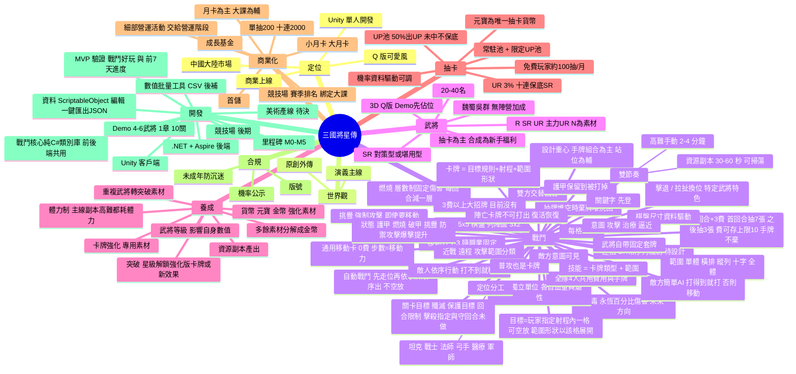

# 三國將星傳

以三國為題材的 Q 版手遊抽卡養成 RPG。商業上線取向，Unity 開發，單人團隊，主攻中國大陸市場。

> 本文件記錄設計核心思路與決策脈絡。每次討論後同步更新「已確認決策」、「心智圖」與「待決問題」。

## 1. 專案定位

| 項目 | 決策 |
|---|---|
| 目標 | 真實開發並上線（商業取向） |
| 引擎 | Unity |
| 團隊 | 1 人（程式 + 企劃；美術、營運僅基本概念） |
| 目標市場 | 中國大陸 |
| 美術調性 | Q 版 / 可愛風 |
| 劇情 | 《三國演義》主線 + 部分原創外傳 |
| 商業模式 | 抽卡 + 月卡 / 成長基金 / 禮包 |

## 2. 戰鬥核心（遊戲骨架）

- **設計重心**：手牌組合（費用管理、連招、關鍵字聯動）為主，站位為輔。站位效果要一眼看懂、不需精算。
- **棋盤**：敵我共用一張 5x5 棋盤（敵方在上兩列、我方列陣區為下方 3x2），每格一人。
- **站位**：戰前在列陣區排兵布陣，戰鬥中靠通用 0 費「移動」卡走位（正交、不可穿越單位、步數 = 武將移動力）；位置決定射程與範圍命中。擊退 / 拉扯 / 換位日後只作為特定武將的特色。
- **目標與範圍**：卡牌以「目標規則 + 射程（格距）+ 範圍形狀」描述；單體敵人牌由玩家指定射程內任一格（可空放），自動戰鬥挑最近者。
- **資源規則**：每回合 +3 費（可存、上限 10）；首回合抽 7 張、之後每回合抽 3 張；**手牌不棄**（上限 10）；抽牌堆抽完時把棄牌堆洗回。
- **第一版範圍（2026-10-08 收斂）**：只圍繞攻防、爆擊、爆傷、移動、攻擊目標、治療、護盾；異常狀態只留燃燒（層數制固定傷害，長期戰主力）。昏亂、蓄力、召喚、引爆、破釜 / 蓄勢暫不做；中毒（永恆%傷）列為未來方向。
- **敵方意圖**：敵人行動預告（可見意圖），玩家據此決策。
- **出牌**：全隊共用牌庫，每回合抽手牌（類《殺戮尖塔》）。武將技能以「卡牌類型 + 範圍」表示。
- **隊伍與資源**（參考《超時空方舟》）：全隊（暫定 4 名武將）共用費用與手牌。
- **定位分工**：
  - 坦克：擋傷害、嘲諷，以加防禦為主
  - 戰士：前排輸出，能扛能打能破甲，樣樣會但不精
  - 法師：AOE、燃燒疊層
  - 弓手：攻擊後排（取代刺客）
  - 醫療：治療、上護甲（原輔助）
  - 軍師：群體 / 單體 buff，兼抽牌與費用
- **套牌結構**：每名武將自帶一整組固定套牌（固定 6 張：R = 6 普通攻擊、SR = 5 普通攻擊 + 1 高級牌、UR = 4 普通攻擊 + 2 高級牌，高級牌由職業決定，見 docs/heroes.md 4.1），外加武將被動。普通攻擊也是卡牌。
- **強化方向**：強化卡牌效果（傷害、數值、附加效果）或強化武將本身。
- **武將陣亡**：其卡牌變為不可打出；若有復活技能，復活後恢復可用。
- **節奏兩軌並存**：
  - 資源副本：30–60 秒，可自動戰鬥 / 掃蕩。
  - 高難關卡：2–4 分鐘，手動操作。

## 3. 心智圖

## 4. 合規備註（中國大陸）

- 需取得遊戲**版號**方可付費營運（涉及發行 / 代理 / 資質，是獨立開發者的重大現實門檻）。
- 抽卡**機率必須公示**，且實際機率需與公示一致。
- **未成年人防沉迷**：實名認證、時長與儲值限制。
- 以上僅為設計階段的提醒，上線前需向專業人士或發行方確認最新規定。

## 5. 待決問題

1. 戰鬥細節：中毒設計、多重挑釁優先順序、自動戰鬥的例外、敵人類型（見 docs/combat.md 第 14 節）
2. 範圍形狀擴充與卡牌資料結構
3. 武將細節：R 的定位、SR 與 UR 的強度差距、3D 模型製作來源（見 docs/heroes.md）
4. 養成細節：突破各星級內容、卡牌強化線、體力設計（見 docs/progression.md）
5. 抽卡細節：單抽價格、硬保底、SR/R 機率（見 docs/gacha.md）
6. 經濟與商業化：貨幣、體力、月卡 / 基金的數值設計
7. 單人開發的 MVP 範圍與里程碑
8. 美術產線（Q 版角色、Spine / Live2D、素材外包或工具）
9. 發行與合規路線

## 6. 文件索引

- [戰鬥系統設計](docs/combat.md)（第一版，2026-10-08 瘦身）
- [武將設計](docs/heroes.md)（草案）
- [養成設計](docs/progression.md)（草案）
- [抽卡設計](docs/gacha.md)（草案）
- [商業化設計](docs/monetization.md)（草案）
- [開發範圍與里程碑](docs/roadmap.md)（草案）
- [M0 資料結構草案](docs/data-model.md)（草案）
- [世界觀與劇情大綱](docs/worldbuilding.md)（草案）
- [第零章：涿縣盜匪（10 關教學）](docs/chapter0.md)（草案）
- [戰鬥機制教學藍圖（10 關，原黃巾之亂）](docs/demo-chapter1.md)（草案）
- [第 1–7 天內容節奏表](docs/days-1-7.md)（草案）
- 後續：數值、抽卡、經濟…

## 6.1 程式碼

- `src/SanGuo.Core`：戰鬥模擬核心（純 C#，netstandard2.1，Unity 與 .NET 伺服器共用）
- `tests/SanGuo.Core.Tests`：xUnit 測試（`dotnet test SanGuo.sln`）
- `src/SanGuo.Server`：後端（ASP.NET Core 最小 API + SQLite，共用 SanGuo.Core）；`tests/SanGuo.Server.Tests` 為整合測試
  - 啟動：`dotnet run --project src/SanGuo.Server`（資料庫檔路徑由 `Database:Path` 設定，開發用端點由 `Game:EnableDevEndpoints` 開啟）
  - 帳號：`/auth/guest`、`/auth/register`、`/auth/login`、`/auth/bind`、`/auth/logout`、`/auth/me`、`/account/nickname`；其餘端點帶 `Authorization: Bearer <token>`
  - 客戶端連伺服器：啟動參數 `-sanguoServer http://主機:埠` 會先進登入頁；`-sanguoAccount <id>` 為開發用，略過登入（伺服器需開開發模式）
- `client/`：Unity 6.3 LTS 專案（6000.3.25f1），戰鬥畫面原型
- `tools/sync-core.ps1`：建置核心並複製 DLL 進 Unity
- `tools/shot.ps1`：打包 Windows 版並自動截圖到 `build/shots`（`build/` 不進版控）

開啟方式：Unity Hub 加入 `client/` 資料夾 → 開啟 `Assets/Scenes/Battle.unity` → Play。

## 7. 決策紀錄

| 日期 | 決策 |
|---|---|
| 2026-10-06 | 專案啟動：確認定位、市場、美術調性、戰鬥骨架、商業模式、劇情取向 |
| 2026-10-06 | 戰鬥細化：4 人共用費用與手牌、武將自帶固定套牌、普攻為卡牌、陣亡卡牌失效、共用棋盤（規模待定） |
| 2026-10-06 | 戰鬥細節：目標取施放者前方最前排（可放空）、敵方簡單 AI、雙方交替回合、每格一人、有 3 費以上大招牌；戰鬥設計獨立成 docs/combat.md |
| 2026-10-06 | 武將：魏蜀吳群、暫無陣營加成/羈絆、N/R/SR/UR（主力 UR）、20–40 名、3D Q 版（Demo 先佔位）、抽卡為主＋合成為新手福利；獨立成 docs/heroes.md |
| 2026-10-06 | 稀有度改為 R/SR/UR（N 為素材）、SR 分對策型/堪用型；養成初期只做突破、重複武將轉突破素材、多餘分解成金幣、資源副本產出、體力制；新增 docs/progression.md |
| 2026-10-06 | 養成三線：武將等級、卡牌強化（專用素材）、突破（星級解鎖強化版/新效果）；體力涵蓋所有關卡；元寶為唯一抽卡貨幣 |
| 2026-10-06 | 抽卡：常駐池＋限定 UP 池、UR 3%、UP 50% 不保底、十連保底 SR、免費玩家約 100 抽/月、機率可調；新增 docs/gacha.md |
| 2026-10-06 | 商業化：單抽 200／十連 2000、月卡為主大課為輔、小/大月卡＋成長基金（數值為建議值）、首儲、競技場賽季排名綁定大課、細部營運活動延後；新增 docs/monetization.md |
| 2026-10-06 | 開發：MVP 驗證戰鬥好玩與前 7 天進度；Demo 4–6 武將/1 章/約 10 關；後端 .NET + Aspire；競技場後做；戰鬥核心建議獨立為共用 C# 類別庫；新增 docs/roadmap.md |
| 2026-10-06 | 戰鬥元件：棄牌洗回重抽、關鍵字改三國風（破釜/蓄勢/先登）、範圍形狀第一版、6 個狀態、7 種敵方意圖、4 種關卡目標；每週投入 40 小時以上 |
| 2026-10-06 | 戰鬥規則：武將為獨立單位、護甲保留、敵人依序行動且打不到就移動、費用回合間保留、移動速度為武將屬性 |
| 2026-10-06 | 挑釁強制攻擊（含移動）、持續回合由卡牌決定；近戰/遠程攻擊範圍分類；移動速度 1–3 隨職業固定；新增 docs/data-model.md（M0 資料結構草案） |
| 2026-10-06 | 數值：7 項屬性（血量/攻擊/防禦/閃避/速度/爆擊/爆傷）、卡牌寫倍率、乘法減傷公式（類 LoL）、保留隨機（爆擊/閃避，種子可重播） |
| 2026-10-06 | 速度屬性＝移動按鈕的移動範圍（1–3，職業固定）；資料編輯採 Unity ScriptableObject + 一鍵匯出 JSON（前後端共用，不用額外轉檔） |
| 2026-10-06 | 開始 M0：完成戰鬥核心與 Demo 內容（劉關張＋諸葛亮＋趙雲 vs 黃巾），22 個測試通過；首次自動對戰顯示數值偏肉（平均 29.9 回合） |
| 2026-10-06 | Unity 版本定為 6.3 LTS（6000.3.25f1）；Demo 教學關數值調整為約 9 回合（我方攻擊 ×1.5、敵人血量 ×0.5、敵人攻擊 ×2） |
| 2026-10-06 | M1 啟動：Unity 專案放 `client/`；UI 全程式碼 + USS；以批次打包 + 自動截圖驗證畫面；戰鬥畫面原型完成 |
| 2026-10-06 | **畫面方向定為橫式為主**（參考解析度 1920x1080）：我方在左、敵方在右，同一路橫向對齊，前排靠近中線；下方為費用 / 手牌 / 戰鬥紀錄。視窗比例不同時整體縮放（Shrink） |
| 2026-10-06 | **移動改為全隊共用的按鈕**（每回合限 1 次、1 費，點按鈕 → 選武將 → 選目的地，落在隊友格會換位），不再是牌庫裡的移動卡，避免稀釋手牌；套牌改為基礎牌為主 + 專屬技能 |
| 2026-10-06 | 美術原型：安裝 Blender 5.2.1，以腳本程式化生成 Q 版武將佔位模型（`tools/blender/chibi.py`）；新增戰鬥演出（飄字、前衝、受擊抖動） |
| 2026-10-07 | **視角修正為等角視角（Hades 式）**：攝影機俯視 50° 並左右轉 45°，地磚呈菱形；UI 改為右下角放手牌 / 費用 / 移動 / 結束回合、左下角放戰鬥紀錄。使用者要求**商用等級美術**，目前程式化模型僅為佔位 |
| 2026-10-07 | **戰場改為 3D、45 度斜視**：正交攝影機俯視 45°，3D 地磚與 Q 版角色模型（Blender 腳本生成 FBX），UI 只負責手牌 / 費用 / 角色頭上標籤；技能預覽與移動範圍改成地磚上色。評估 Spine AI skill（GenielabsOpenSource/spine-animation-ai）：僅 2D 且授權為非商業，商業使用需另洽授權，暫不採用 |
| 2026-10-07 | **戰鬥設計重心：手牌組合（B）為主、站位（A）為輔**。理由：中國手遊玩家耐性低，不適合以站位解謎為主。站位保留為「一眼看得懂的輔助策略」（擊退、換位、保護後排），不要求精算；牌的設計重心放在費用管理、連招、關鍵字聯動 |
| 2026-10-07 | **連招骨架採混合式**：基礎走「狀態引爆」（先上破甲/火攻/瘟毒等狀態，再用牌引爆或吃加成），UR 才帶「出牌序列」型特殊機制（第 N 張、連續同類型、費用花完觸發）作為差異點 |
| 2026-10-07 | **狀態引爆規則**：每種狀態對應單一引爆方式；破甲為持續加成不消耗，火攻 / 瘟毒引爆即消耗；**昏亂改累積制**（敵人有昏亂條，滿了才眩暈，BOSS 條更長，避免對 BOSS 過強）。詳見 docs/combat.md 11.1 |
| 2026-10-07 | 昏亂防連控：觸發後敵人昏亂條上限遞增（暫定 +50%，資料欄位：基礎上限、遞增比例） |
| 2026-10-07 | **定位調整**：刺客→弓手（打後排）、輔助→醫療（治療、上護甲）；坦克以加防禦 buff 為主；軍師提供群體 / 單體 buff（兼抽牌與費用）；戰士為前排全能但不精（能扛能打能破甲）。程式碼的 Role 列舉（Assassin / Support）待改名 |
| 2026-10-07 | 屬性 buff 統一為「屬性修正 + 持續回合」（坦克加防禦、軍師 buff、破甲同一機制）；戰鬥內永久疊加留給特定 UR 作特色 |
| 2026-10-07 | **Demo 擴充**：現有 Demo 關卡太少、只有小怪，驗證不了設計，決定往前推進。第一章「黃巾之亂」10 關，武將 6 名（新增黃忠為弓手、趙雲改戰士），新敵人類型（妖道 / 渠帥 / 術士 / BOSS 張角）；核心需補昏亂條、引爆、buff、蓄力 / 召喚意圖、保護 / 守回合目標。詳見 docs/demo-chapter1.md |
| 2026-10-07 | Demo 第 1、2 關實作完成；第 2 關弓手加強為「黃巾神射」以逼出挑釁 / 優先處理的需求；實作方式為做一關、驗一關 |
| 2026-10-07 | **破甲簡化**：不再是易傷加傷，改為純粹降低防禦，可疊層、各層乘算、持續回合刷新（已實作，`StatusType.Vulnerable` 改名 `ArmorBreak`，關羽溫酒斬將每層 -25%）；不做「專吃破甲」的牌 |
| 2026-10-07 | **移動玩法調整（待落地）**：試玩後認為全隊共用移動按鈕雞肋又廉價，改為只有特定輔助類武將才有的技能（含換位、擊退、拉扯等位置效果）；全隊移動按鈕之後移除，細節待定 |
| 2026-10-07 | **目標判定改為「同路優先、沒人就由上往下找」**（取代「無目標不可打出」，避免死牌）；路由上到下編號，第 1 路成為預設坦克位，站位有操作意義；雙方同規則，敵人不再需要移動；挑釁不分路強制攻擊。**推拉 / 換位保留**，但只作為特定關卡與特定武將的特色招式與互動（不是全隊通用按鈕）。已實作，自動對戰回合數大降（第 1 關 8.6→4.7、第 2 關 15.9→7.1），數值待重調 |
| 2026-10-07 | **全隊移動按鈕移除、改為戰前編隊**：進關卡先排兵布陣（5 路 × 前後排，點武將再點格子移動 / 換位），戰鬥中不能移動；推拉 / 換位日後做成特定武將或關卡的特色技能。核心 `MovesPerTurn` 預設改 0（移動 API 保留供日後技能使用）；Unity 新增編隊畫面與「編隊」按鈕，移除移動按鈕與移動模式程式碼 |
| 2026-10-07 | **Demo 關卡設計原則**：10 關皆有教學意義，沒有善加利用該關教的機制，亂玩或自動戰鬥就該輸（第 1 關純教學除外）；每關以「能出就出」與「照教學打（優先度策略模擬）」兩種勝率量化驗證 |
| 2026-10-07 | 第 3 關「力士攔路」完成（鐵甲力士防禦 800、限 11 回合、破甲 40%/層 3 回合；自動 28%、照教學 86%）；新增 4 名 R 級測試小兵（義勇兵 / 鄉勇盾兵 / 鄉勇弓手 / 鄉勇醫士）與稀有度欄位（現有 6 名武將暫標 UR）；編隊畫面可從全部武將自選上場（最多 4 人）；新增大地圖選關（打贏才開下一關、進度存本機）與勝敗後的「下一關 / 再打一次 / 回地圖」。**第 2 關尚不符合設計原則（自動 100% 會贏），待重做** |
| 2026-10-07 | **破甲改為獨立百分比（不用層數）**：每次施加是一筆（百分比＋回合），各筆各自到期、彼此乘算（40% 與 15% 並存）；**後排優先目標**（弓手 / 遠程，雙方通用）：不分路，先最後一排由上往下，沒人再往前一排；「瞄最脆弱」留給個別武將特性；**要求「照教學打」勝率 100%**（目前第 3 關約 92%、自動 35%，尚未達成，見 docs/demo-chapter1.md） |
| 2026-10-07 | **教學關設定**：教學關不開放自動戰鬥；隊伍固定、編隊先鎖定（之後再開放）；用 R 級小兵湊數，一兩名武將帶該關教學的技能卡上場；教學卡一律帶「先登」。驗證改為「照教學打」與「忽略教學」兩個勝率。第 3 關 99% / 4%；第 2 關挑釁價值還不明顯（照教學 94% / 忽略 82%），待決定機制方向 |
| 2026-10-07 | **挑釁價值：挑釁期間挑釁者受到傷害 -30%**（方案 B，取代「挑釁只是改變目標」）；第 2 關神射手 ×2；第 2 關照教學打 100% / 忽略教學 64%（存活 3.0 vs 1.2），第 3 關 99% / 4% |
| 2026-10-07 | 第 4 關「妖道作亂」完成：新增敵方治療行動（`EnemyAbility.Healer`，意圖顯示「治療→X」）與黃巾妖道；黃忠「百步穿楊」帶先登；照教學打 100%（存活 3.6/4）、忽略教學 0% |
| 2026-10-07 | **教學關牌序寫死**（採用使用者建議）：`ScriptedDraw` 指定每次抽牌堆重建時排最前面的起手牌、`NoRandomness` 關閉爆擊閃避，結果完全可重現；第 2–4 關照教學打 100%、忽略教學 0% |
| 2026-10-07 | **第一章 10 關全部完成**（核心與測試）：新增蓄力大招、昏亂條（滿了才眩暈、上限 +50%）、保護目標、火攻引爆擴散、召喚、可組合的敵人能力旗標；第 2–10 關都是照教學打 100%、忽略教學 0%（40 個測試）。第 3、7、8 關有回合上限。詳見 docs/demo-chapter1.md 4.1.3 |
| 2026-10-06 | 目標判定：同路最前排敵人為中心、無目標不可打出、自動戰鬥由左至右能出就出、棋盤尺寸資料驅動 |
| 2026-10-06 | 棋盤與資源：雙方各自 5x2 且只在自己範圍移動、移動卡、自動判定目標＋範圍、3 費 5 張（費可存上限 10、手牌不留）、敵方意圖可見 |
| 2026-10-07 | docs/days-1-7.md v3：依手遊前七天留存建議重排——每日 D1 2–3h、D2–3 約 2h、D4–7 1.5–2h（7 天約 12–15h），內容總量 20–25h（獨特主線約 55 關＋重複內容複用）；漏斗式解鎖、七日目標任務（UR 大獎）、軟/硬卡點、帳號等級卡主線。抽卡投放 7 天約 100 抽與原錨點（月 100 抽）衝突，待決 |
| 2026-10-07 | 前七天為留存特例（新手紅利約 100 抽），第 8 天起回長期錨點每月約 100 抽；七日節奏只取適合本作的點（不加裝備 / 公會 / 家園）；競技場先做簡易版（D4），之後演進或改名為終局內容 |
| 2026-10-07 | 抽卡設計以知乎〈聊聊抽卡这件事〉為指導原則：對照本作列出缺口（保底、目標保底、積分商店 / 滿星溢出回收、刷初始、進度條、抽卡流程演出）；明確禁止付費型概率作假；不做全局屬性圖鑑。保底方案待決（見 gacha.md 第 7 節）|
| 2026-10-07 | 抽卡保底定案：硬保底 80 抽必出 UR、UP 池大小保底（上一隻 UR 沒中 UP 則下一隻必 UP，抽到 UP 期望約 50 抽）；取代 10/06「UP 未中不保底、暫無硬保底」。程式預設值已改，機率公示須同時公示保底規則 |
| 2026-10-07 | **掃蕩：三星通關才能掃蕩**；星級暫定 ★通關、★★無武將陣亡、★★★無陣亡且回合數在門檻內（門檻待調）。**資源副本：每日輪替主題、每天固定次數**（金幣 / 經驗書 / 卡牌強化素材，每次 10 體力、每日 3 次，打贏一次後可掃蕩）。每日重置以北京時間 5 點為界。任務與七日目標共用事件回報；七日里程碑 60 / 120 / 200 點，大獎 UR 暫以張飛佔位 |
| 2026-10-07 | **後端資料庫先用 SQLite**（儲存層可替換，上線前換 PostgreSQL）；後端為 ASP.NET Core 最小 API 直接引用 SanGuo.Core。**關卡結算改為戰鬥重播驗證**：伺服器發種子、客戶端回傳操作紀錄、伺服器重播並自算勝負與星數（反作弊）。成長倍率已接進戰鬥（`HeroGrowth.BuildSlot`）；存檔與內容資料都有 JSON 序列化（無外部依賴） |
| 2026-10-07 | **位移技能（擊退 / 拉扯 / 換位）被擋住時的規則：使用者之後再想**，暫不實作；復活與被動缺具體設計，列入待決，不自行編造 |
| 2026-10-07 | **客戶端接線**：後端介面（單機 / 伺服器兩種實作）、戰鬥操作全程錄製、結算交後端重播驗證；地圖顯示等級 / 體力 / 星數，關卡資訊含掃蕩；新增招募、武將（升級 / 突破 / 卡牌強化）、資源副本、每日任務與七日目標、商店畫面。開始 / 結算流程收進核心 `StageFlow`（主線與資源副本共用）。資源副本戰鬥內容暫用第 1 關占位 |
| 2026-10-07 | **M4 商業化最小集合（測試環境）**：月卡 ×2、成長基金、冪等的訂單流程與開發用模擬付款（數字沿用 monetization.md 建議值）；真正的支付渠道、首儲內容待決 |
| 2026-10-07 | **世界觀與第零章**：主角為穿越成涿縣同鄉的聰明少年（軍師型指揮官，手握「命牌」）；原「黃巾之亂 10 關」的機制整段保留，敵人改為盜匪 / 山賊成為第零章（黃巾留給第一章）；首通第 1–3 關依序送劉備、張飛、關羽；黃忠、龐統、趙雲只當教學關借將；後期架空為「命牌碎片魔化群雄」（草案）；客戶端新增劇情對白播放。劉關張改 SR 暫緩 |
| 2026-10-07 | **專案目標：公司提案 demo**（非上線）。美術用公司資源（另一個工作階段處理）；真實支付、帳號登入、防沉迷與機率公示本版不做（提案簡報帶過）；**復活與被動只是「可能有」的設計，不在本版範圍** |
| 2026-10-07 | **養成真正進入戰鬥**：第 1–8 關維持教學固定隊伍（教完現有機制），**第 9、10 關與資源副本改用玩家編隊**（只能帶已擁有的武將、最多 4 人、站位不重疊），戰鬥套用武將等級 / 突破 / 卡牌強化並開放自動戰鬥。開始關卡時客戶端送編隊給後端，伺服器記下並在結算時用同一份重建戰鬥重播驗證（`FormationEntry` / `FormationRules`，見 demo-chapter1.md 4.4）。資源副本各有敵人配置，不再占位 |
| 2026-10-07 | 新增中文字型（Noto Sans TC，SIL OFL）、`AudioManager`（BGM 取自 TS6Client，音效程式合成）與新手引導（主城歡迎、第 1 關出牌教學；看過記在本機 PlayerPrefs） |
| 2026-10-07 | **劇情與效能修正**：①教學關客串黃忠 / 龐統 / 趙雲改為無名鄉野人物（獵戶、書生、遊俠，數值與牌沿用，教學驗證不變），名將留到後面章節；②第 9 關劉備改問「感覺你不像以前我認識的那個人」，符合主角是他認識的同鄉；③卡頓處理：URP 改 Forward、關 SSAO / HDR / 多級陰影，劇情只讓目前顯示的立繪相機繼續渲染 |
| 2026-10-08 | **非戰鬥 UI 商業化整理**：新增 `Polish.uss` 統一規格（按鈕標準 240×84 / 小 168×64 / 大 320×100、一律 margin 0；橫向分頁 76 高、武將頁右側功能分頁三等分、任務側欄同寬同高；卡片等高、按鈕貼底）。移除教學性質文字（副本 / 商店 / 編隊提示條、費用「持有：」說明），改用「需要/持有」費用呈現、紅點、「N 級解鎖 / 明天開放」狀態按鈕、星級條件逐條打勾；任務可領取者排最前並有分頁紅點；編隊頁底部固定操作列、站位大卡與欄位標籤對齊；關卡面板加右上關閉鍵。樣式只掛在非戰鬥頁面（host 的 `meta-page` class），不影響戰鬥畫面。`ShotRunner` 增加次要畫面截圖（招募主畫面、關卡面板、武將各分頁、七日目標） |
| 2026-10-08 | **戰鬥第一版瘦身**：只圍繞攻防 / 爆擊 / 爆傷 / 移動 / 攻擊目標 / 治療 / 護盾，異常狀態只留燃燒。移除昏亂（昏亂條）、敵方蓄力與召喚、引爆、瘟毒、破釜 / 蓄勢、戰鬥內等級成長（死碼）與 Debug 直接勝利；**燃燒改為層數制固定傷害（每回合 −1 層、再施加疊層）**，中毒預留為「永恆百分比傷害」方向暫不做；**抽牌堆抽完時棄牌堆洗回**（修正長期戰僵局）；第 5、7、8、10 關重新設計（旋風斬 / 燃燒疊層 / 縱列穿透 / 綜合 BOSS）；星級回合門檻改為「限制 − 1」。全部文件同步更新，見 docs/combat.md 第 15 節 |
| 2026-10-09 | **帳號系統（程式，美術為佔位）**：分工改為使用者企劃、Claude 程式、Codex 美術。伺服器新增遊客登入（裝置上的隨機金鑰，非硬體 ID）、帳號密碼註冊 / 登入、遊客綁定帳號密碼、暱稱（排行榜顯示暱稱，不公開帳號 id）；密碼 PBKDF2 加鹽、token 只存雜湊、30 天到期、登入類端點每 IP 每分鐘 30 次限流；遊戲端點改用 Bearer token，`X-Account` 只留在開發模式。客戶端新增登入頁與帳號頁（點主城左上玩家卡進入），token 失效自動回登入頁；單機版不需登入。**待企劃決定**：手機號 / 簡訊驗證碼登入、第三方登入（微信 / QQ）、實名認證與未成年防沉迷（大陸上線必備）、帳號註銷、改密碼 / 忘記密碼流程 |
| 2026-10-09 | **模擬試玩後的調整方向定案**（見 docs/playtest-sim.md、docs/adjust-plan.md）：①SR／UR 每名 2 張專屬牌、UR 與劉關張 5★ 解鎖被動；②武將加「刷圖型／Boss 型」定位軸（可抽 SR 每職業各 1，UR 3／3／2 泛用），玩家先刷資源再衝 Boss；③**稀有度影響基礎屬性 R 100／SR 115／UR 135%**（取代「同職業同屬性」）；④劉關張維持送滿突；⑤世界 Boss 維持本季單場最高，加每日固定種子；⑥素材副本逐階解鎖（只看前一階，不看主線章節；第 1 階的開放時機沿用 0-4 通關）、裝備機率掉落且越高階越難掉；⑦每次帳號升級回滿體力；⑧無課月抽首月約 100、之後約 70；⑨新增元寶儲值 6 檔（首次雙倍）；⑩終局內容做困難主線。主線失敗扣體力待重新量測後再議 |
