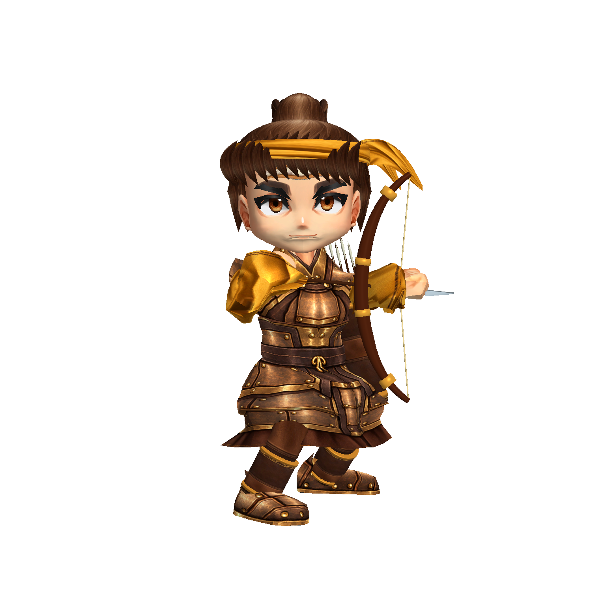
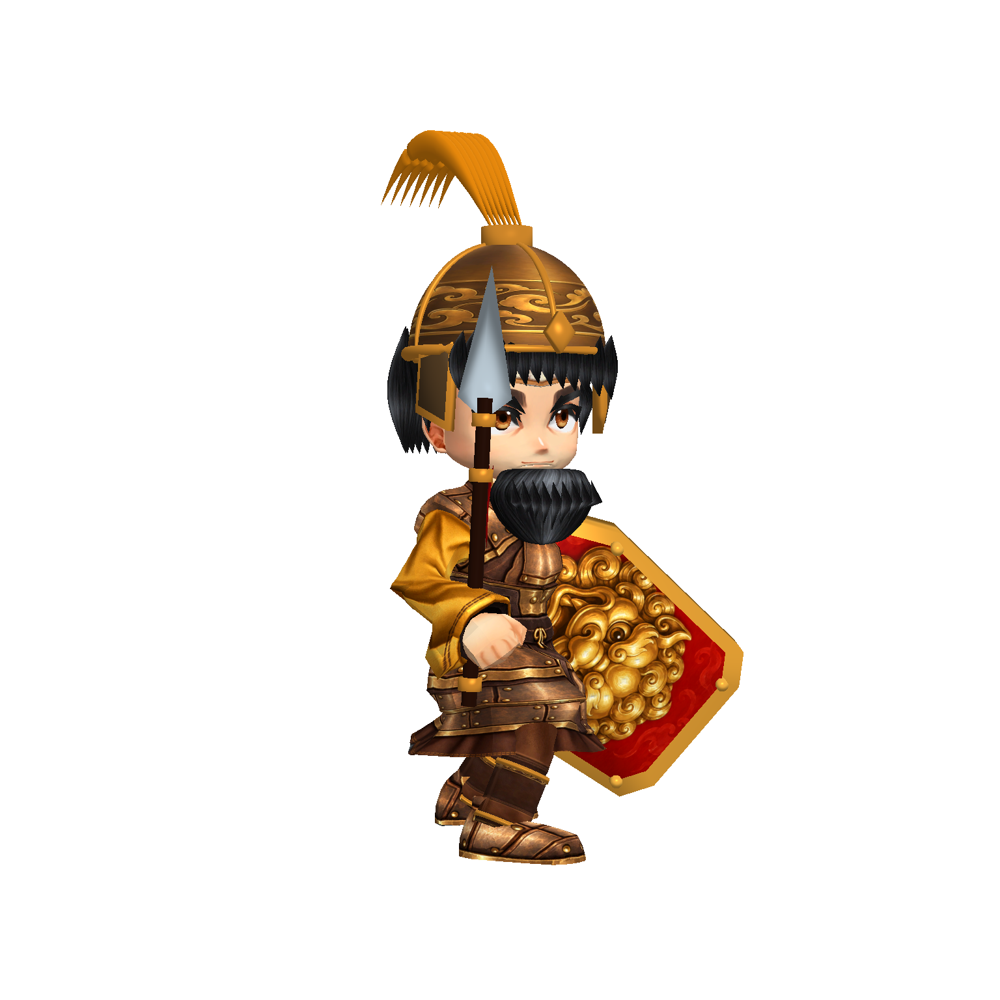
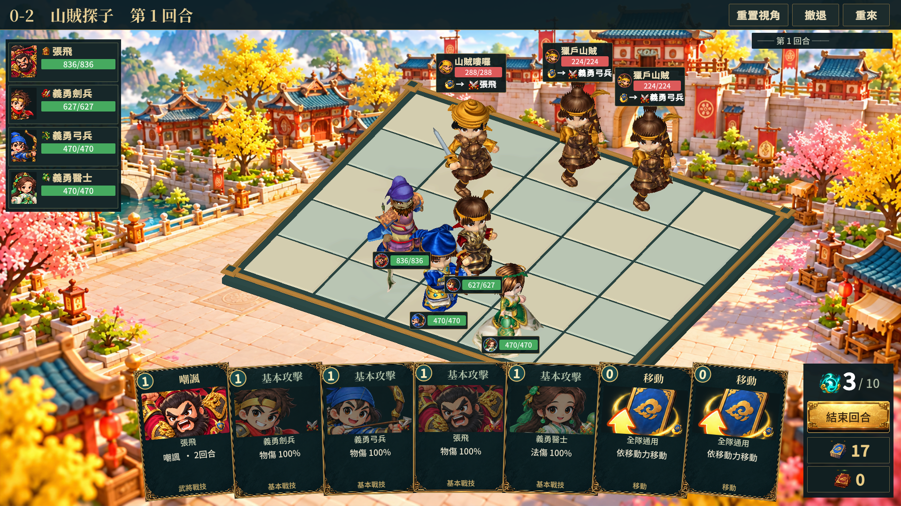

# 山賊模型第六階段（2026-10-09）

這是可重製的美術改善階段，整體尚未通過商用驗收。

## 本次完成

- 重製 bandit_grunt、bandit_archer、bandit_ironbrute、bandit_marksman 四種實際角色；完整戰鬥驗收後補齊獵戶的獨立 ID，避免只改到未登場的弓兵。
- 使用既有盾兵身體／骨架和鄉勇面部底材，製作青銅甲、黃巾衣料貼圖，新增頭巾、獵戶頭带與髮髻、黑髮、鬍鬚、短劍與短矛。沿用前階段短裙甲、可動褲裝、箭袋與盾牌結構。
- 山賊弓兵與獵戶改用各自輸出的待機／射擊動畫素材；沒有增加執行期 IK 或修改遊戲功能。
- 修正不同拓撲的骨架網格重製時殘留頂點資料，覆寫前清空舊網格，再寫入新 UV、權重與三角形資料。
- 修正獵戶髮束懸空，並讓敵人的零件資產使用各自名稱，避免重製敵人時覆蓋鄉勇裝備。

## 實際驗證

`build/model-quality/bandit-v4/`：四種敵人及鄉勇弓兵共 20 張正面、側面、背面與攻擊截圖，空白／出框檢查通過，執行錯誤 0。

`build/model-quality/team-stage6-final/`：32 張完整 UI 截圖，驗證用 Player 結束碼 0，執行錯誤 0。此為隔離專案的美術驗證版本，不代表其他協作者後續執行期修改也已驗證。

## 仍未完成

張飛仍是錯誤來源造型，下一階段須依既定立繪重製。山賊面部目前共用基礎輪廓，重甲鬍鬚與盾牌、袖口、手掌仍需精修。棋盤仍缺少正式地面層次，世界血條會遮擋其他角色，卡牌與整體版面仍須完成商用驗收。上述執行期版面問題交由程式端依美術規格接入，不能把本批素材提交當作整體完成。
