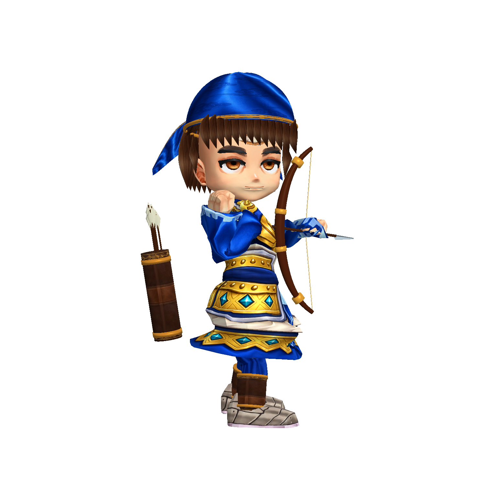
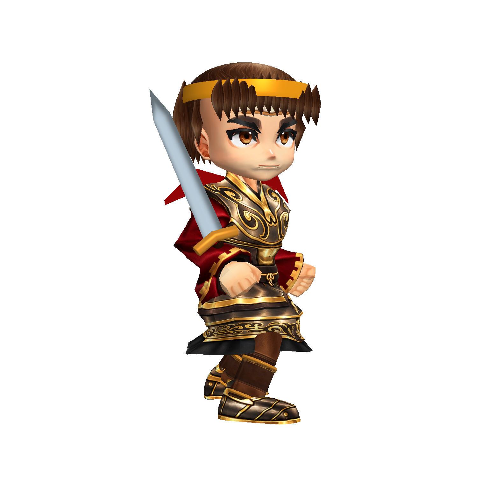
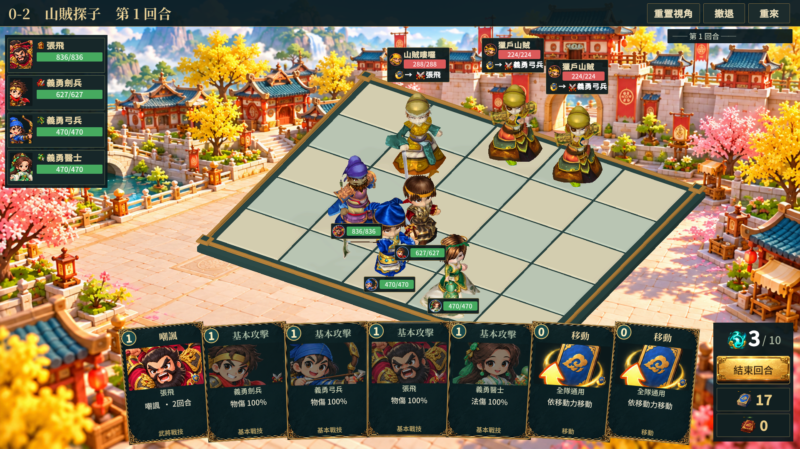

# 戰鬥角色第五階段（2026-10-09）

本階段仍是美術改善提交，未通過整體商用驗收。

- r_sword 現有骨架模型：使用盾兵身體／骨架底材與鄉勇面部底材，新增短髮、黃頭带與雙尾、紅飄巾、立體短劍、短甲裙與可動褲裝。不再退回舊球體模型。暫用烏金甲貼圖，精確對齊劍兵立繪的皮甲與短袖仍待精修。
- 弓兵專用動畫素材：在 Editor 中逐格製作上臂、前臂、手腕、弓與箭的待機／攻擊曲線，保留底材其他動畫曲線。Prefab 改用動畫素材，移除該角色的舊 ArcherPoseRig 元件；沒有修改執行期程式。修正多層手骨尺度反射造成的反向箭，以實際 TransformVector 驗證朝向。
- 縮短裙甲時區分裙甲與袖口骨骼；收窄獨立袖口骨骼，保留手掌與上臂權重。
- 清除自製武器角色的來源 WeaponRenderer，避免底材與新裝備疊加。
- 全部 33 個候選 Prefab 用實際骨架頂點統一身體高度 2.3；第二次重新量測 33 個高度均為 2.3，沒有每次烘焙越來越大。這是比例一致，其他 29 名角色仍未逐一通過美術驗收。

## 驗證

實機 `build/model-quality/bow-animation-v6/` 四名鄉勇共 16 張多角度／攻擊，runtime 錯誤 0，輪廓裁切 0。之前另外檢查八名角色 32 張多角度畫面。完整 UI `build/model-quality/team-stage5/` 32 張截圖，Player 結束碼 0，沒有 runtime 錯誤；此 UI 批次使用修正箭頭前的 v5 素材，僅作同場尺寸檢查，不能作最終箭頭證據。

## 未完成

張飛仍有紫色頭巾與錯誤來源服裝，山賊仍有不符立繪的老年面部與帽型。手掌形狀、布料細節、劍兵短袖、盾牌握持、其他具名角色、同場 HUD 遮擋與整體美術統一仍需改善。本批次不能作商用完成交付。
