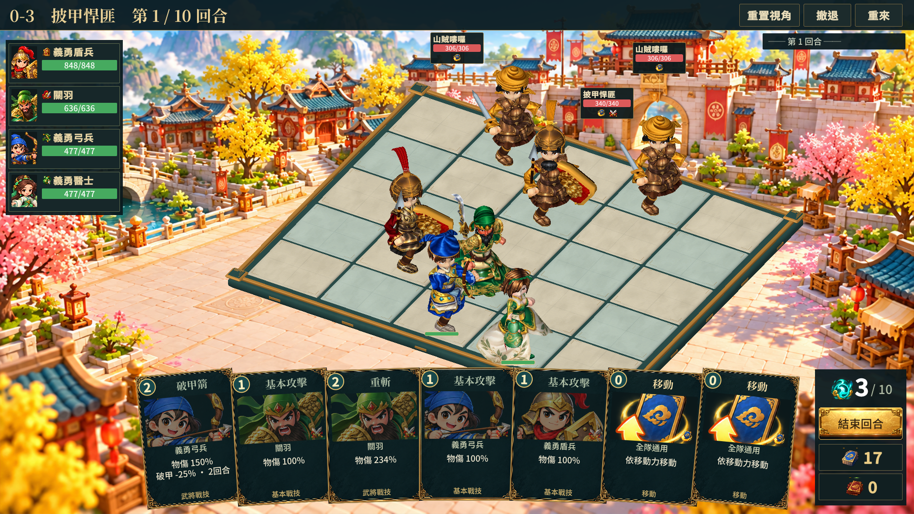
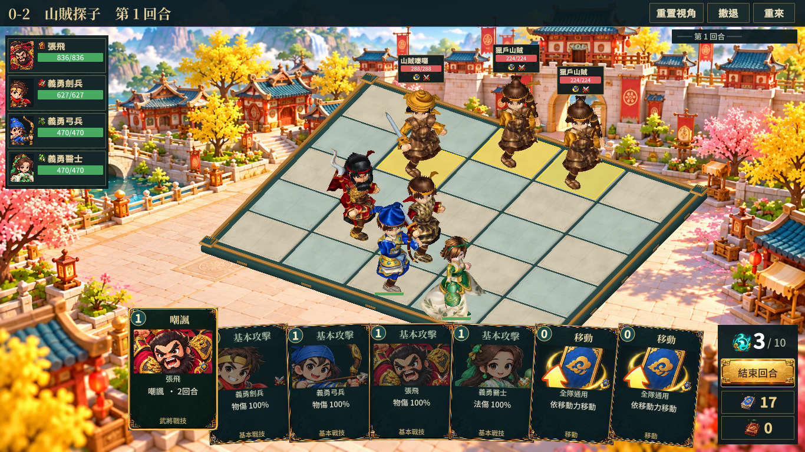
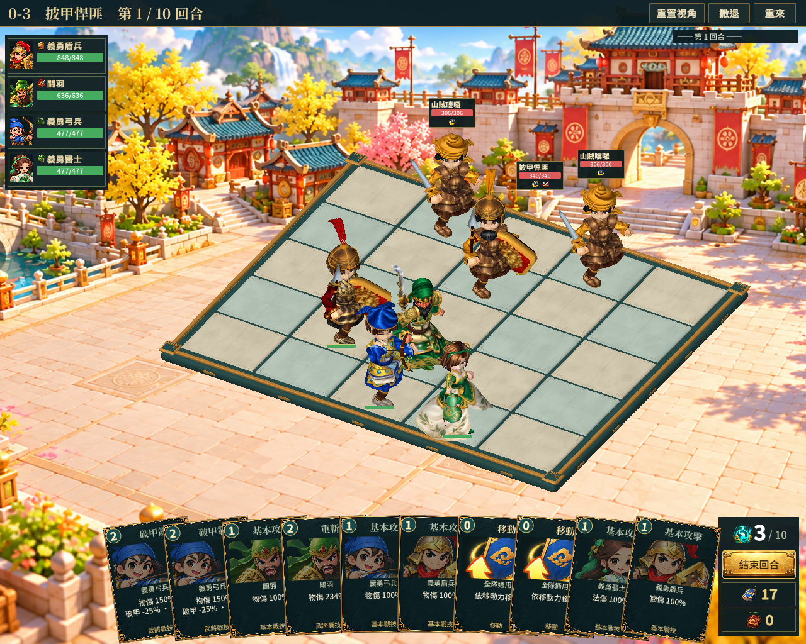
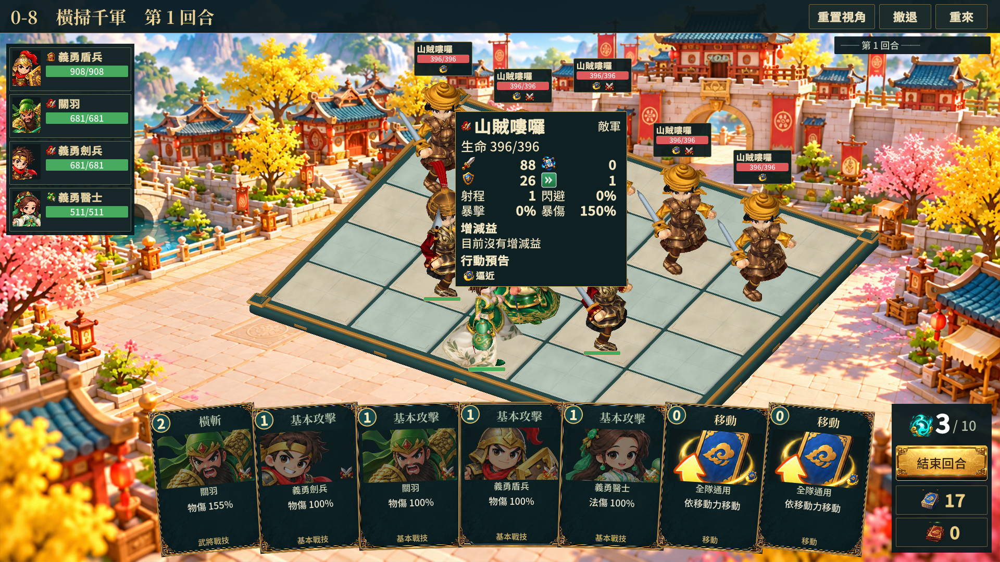

# 戰場棋盤與 HUD：第十一階段

本階段直接接入第八階段的棋盤 Prefab，並修正實際戰鬥 HUD。沿用專案的戰鬥規則，沒有更改技能數值或後端流程。

5×5 場地載入 `ProductionBoard/CourtyardBoard_5x5`，使用暖石、青石、玉色基座與銅金嵌邊；其他尺寸仍使用原地面組裝方式。原 TileTag 與碰撞體保留。透明高亮頂面提高到 y=0.006，未選取時包含邊框在內完全透明，避免舊覆蓋層遮住石材細節。射程、目標與移動高亮仍沿用原色彩語義。

我方世界血條改為 72×9 細條，移除重複頭像與數字；完整血量、狀態保留於左側隊伍欄及懸停詳情。血條以雙腳骨架的投影位置定位，避免角色前傾後留在腿上；只在腳底附近上下避讓，不橫移到另一個角色。擁擠或超出安全區時隱藏世界細條。

敵方標籤寬度改為 112，保留名稱、精確血量、狀態與行動圖示，移除重複頭像與意圖文字；完整行動文字與攻擊目標移至懸停詳情。標籤避讓估算的角色身體範圍、其他標籤、回合紀錄、卡牌詳情及懸停面板；移位時有細連線指向所屬角色的頭頂錨點。安全區限制於戰場容器，不覆蓋上方功能列、左側隊伍欄或下方手牌。

頭頸比例資產修正見 [第十階段](proportions-stage10-review.md)，commit `542534e`。

## 驗證與範圍

隔離 Unity Player 建置後執行 `tools/verify-battle-art.ps1 -ReviewName model-quality/battle-stage11-v4`。1920×1080、1366×768、1280×1024 各 34 張，共 102 張實際流程截圖；包含起始、範圍預覽、選牌、出牌、結算、不同動作、十張手牌、最大縮放、擁擠戰場與敵我懸停詳情。

每種解析度均檢查 14 個戰場畫面：25 個渲染格心射線對應正確、HUD 在容器內且互不重疊、不與可見資訊面板重疊、手牌及牌組文字高度可容納。敵我各一次角色身體懸停辨識也通過。Player 沒有例外、C# 或 Shader 錯誤。下列為目視抽查證據，全部自動檢查通過不等於全部美術細節已完成。

預設取景保留完整場地；使用者主動放大到上限時，3D 棋盤與角色可以超出螢幕，HUD 仍限制在安全區。輪廓避讓使用頭腳投影的保守矩形，並非逐像素遮罩；大型武器與披風仍可能超出估算範圍。這些限制沒有宣稱已完全解決。

商用終驗仍未完成：部分角色手部、握持兵器、披風動畫、尚未精修角色的造型辨識與效能預算仍需後續製作和驗收。本階段只提交上述已接入並验证的修正。
