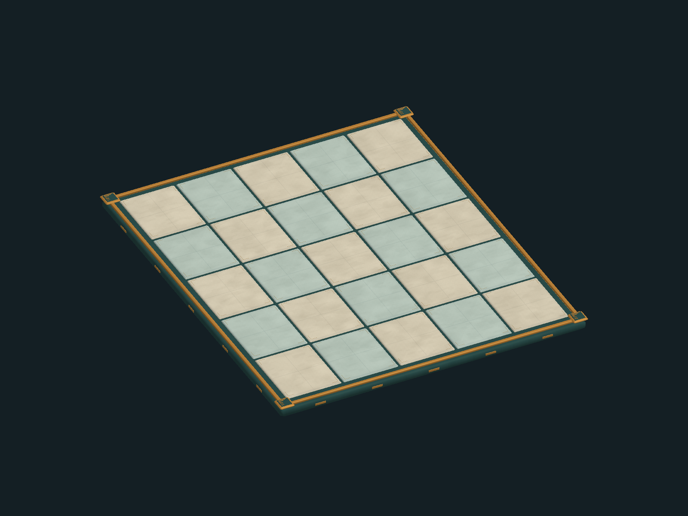

# 棋盤美術第八階段：接入與验收

素材已製作與獨立渲染驗證，**尚未接入執行期戰場**。不以素材預覽宣稱 UI 已完成商用。

## 美術資產

- `client/Assets/Resources/ProductionBoard/CourtyardBoard_5x5.prefab`：暖石與青石、玉色基座、銅金嵌邊、四角幾何刻印，四組材質合併為四個 Renderer。
- `ProductionBoard/Meshes/`、`Materials/`：獨立可編輯資產；不引用 Unity 內建 Cube 材質。
- `client/Assets/Resources/Shaders/ProductionBoardSurface.shader`：石材細紋、輕微磨邊、細嵌角與依幾何法線的明暗，讓格面保持明亮。這是美術材質，不處理戰鬥狀態。
- `client/Assets/Editor/ProductionBoardBaker.cs`：重製與實際 Prefab 渲染工具。隔離 Unity batchmode（有圖形裝置）執行 `SanGuo.Client.Editor.ProductionBoardBaker.Bake`，會輸出 `build/model-quality/board-stage8/board-preview.png`。

本次 Unity 輸出成功，網格有限值與三角形索引檢查通過，沒有 C#／Shader 錯誤。預覽為真實 Prefab 的 1600×1200 渲染，並非生成概念圖。

## Claude Code 程式接入規格

1. 5×5 場地可載入 `Resources.Load<GameObject>("ProductionBoard/CourtyardBoard_5x5")` 作地面美術，替換現有 BuildFloor 生成物；不要疊上兩塊地板。其他格數須另組地板，不能伸縮 5×5 Prefab 破壞格距。
2. Root 原點為棋盤中心，localScale=(1,1,1)，頂面 y=0。row 沿 x、lane 沿 z；格距 x=1.55、z=1.85。格心 `(x,z)=((2-row)*1.55,(2-lane)*1.85)`，與目前 BattleStage.TileWorld 相符。
3. 保留原 TileTag、碰撞體與點格判定；美術 Prefab 不帶 Collider 或戰鬥元件。既有 TileOverlay 只畫高亮，未選取時透明，避免舊平面色塊蓋住石材。
4. 高亮頂面放 y=0.006 以上，避免與格面 z-fighting；透明高亮不可改變格點世界座標，也不可蓋住角色腳部。高亮用原來的黃／藍／綠色語義。
5. 鏡頭取景須包含基座邊界與角色頭頂，不可單純放大後遮住上方功能或下方手牌。

## 戰鬥 HUD 美術修正（仍待程式接入）

`team-stage7/20-battle-start.png` 中友軍血條蓋住弓兵及醫士；縮小整塊 HUD 不能算完成。

- 左側隊伍欄已提供頭像、名稱與精確血量。棋盤上常駐友軍血條改為約 72×10 的細條，不重複放頭像或大數字；選取／懸停時才展開詳細數字。
- 世界血條應貼近所屬角色，避讓模型輪廓；擁擠時不允許移到旁邊角色胸口。必要時隱藏未選取友軍的世界血條，由隊伍欄保持資訊可見。
- 敵人常駐資訊保留血條及意圖圖示；長名字與文字意圖放懸停詳情。選取目標後才突出完整標籤。HUD 錯位時須有細連線或明確歸屬，不能讓玩家誤判。
- 1920×1080 頂部操作列約 64px，下方手牌與行動區約 300px，左側隊伍欄約 256px；棋盤與常駐 HUD 都應留在中間戰場區。小解析度使用實際容器尺寸計算安全區。

## 接入後驗收條件

1920×1080、1366×768、1280×1024：起始、選牌、範圍預覽、移動、攻擊、十張手牌、最大縮放、擁擠戰場與結算都要重新截圖並目視檢查。必須確認格點選取正確、沒有材質粉紅／閃爍，HUD 不遮擋按鈕或旁邊角色。獨立素材渲染不能取代這些接入驗收。
