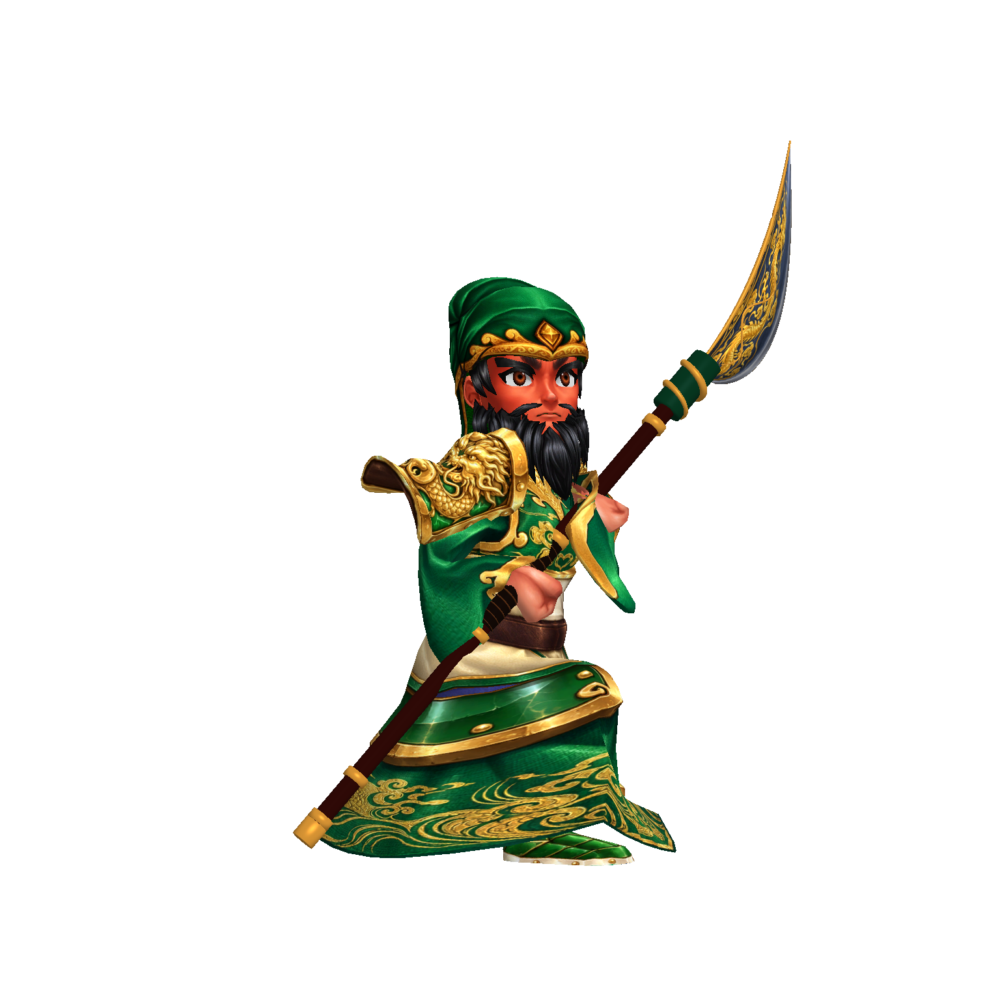
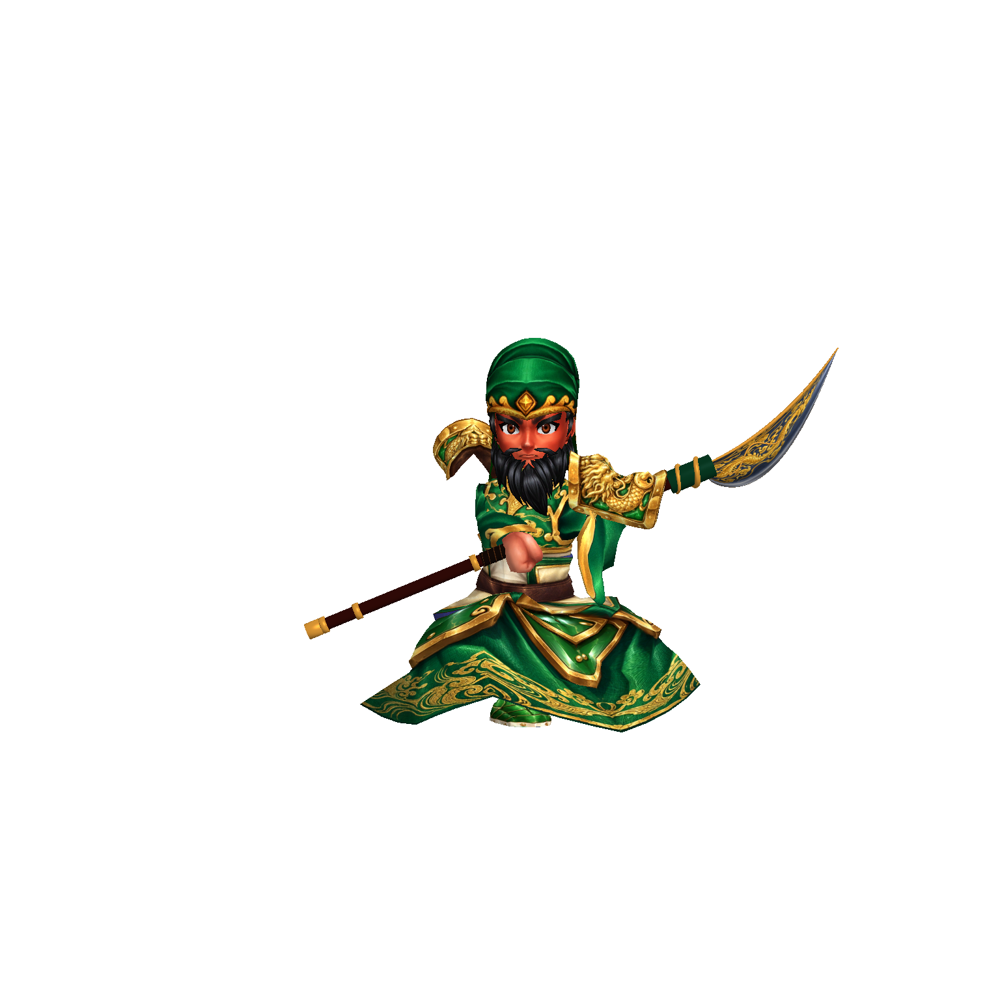
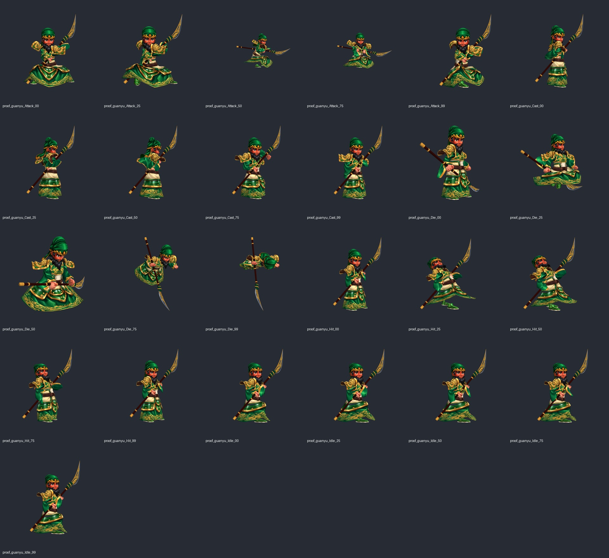

# 第十五階段：關羽青龍刀與雙手握持

2026-10-09。保留使用者已認可的人物網格、面部、鬍髮、衣甲貼圖；本階段替換原 Weapon_00029，新增自行建模的長柄青龍刀、握持及揮刀動畫。沒有改動遊戲規則、後端或其他協作者的檔案。

## 實際完成的修改

- Codex 製作獨立長柄、金屬箍、刀鐏、纏繞皮握把、盤龍刀座、厚度與中央脊線可辨的彎刃。刀面新增內建 imagegen 龍紋貼圖；刻紋視覺來自貼圖，並不宣稱全部龍紋為雕刻拓樸。纏繞握把、盤龍刀座與刀背金條有實際幾何。
- 新增 guanyu_GlaiveIdle／Attack／Cast／Hit 四個動畫，保留原本的身軀、腳步、頭部軌跡，重作雙臂、手掌與兵器軌跡。兩手先求共同可及範圍，再固定兩掌握在刀桿上，解決單独限制手臂伸長後刀身被拉直的問題。攻擊從斜持转為横向揮刀，再收回。
- 原動作另存 guanyu_GlaiveSource*.anim，重跑從同一底稿生成，避免累積修改。倒下仍沿用原骨架動畫，刀隨右掌轉動、左手依原姿勢鬆開。
- ModelStage 僅修改美術預覽取景：長兵器單次動作預留 1.55 倍距離，防止橫揮時刀刃出框。一般待機取景維持既有行為。

底材仍來自專案既有 Characters/guanyu 與先前認可的 ProductionCharacters/guanyu。新增刀全部由本專案製作，沒有採購或外包。

## 功能驗證

隔離 character-copy Windows 建置成功。正常動畫擷取正面、側前、背面、攻擊 4 張，runtime errors=0、無空白與出框。五種動作各取 0／25／50／75／99% 五個時間點，每個時間點有正面、側前、背面與重複定格，合計 100 張；透明輪廓檢查 100 張均無出框。完整原圖與 player.log：build/model-quality/guanyu-glaive-motion-v2。

Editor 原生離線預覽曾出現蒙皮快取／BakeMesh 尺度不一致，v1–v3 離線圖已判定為無效證據，沒有放進本紀錄。有效時序證據使用 ProductionMotionProof.BakeFrozenSamples 在隔離複本產生定格動畫，再由原遊戲 ModelStage／Playables／Animator 實際渲染。ProofScratch 與 proof_*.prefab 不接回正式專案。

## 美術檢查與限制

已人工查看五種動作接觸表及正常側前、攻擊大圖：已修正刀朝肩後與短兵器握法，雙手可見地分開握桿，刀面有清楚金龍與銀色刃緣；正常預覽的橫揮刀刃保持完整。倒下的右手帶刀、左手放開已保留。

這是握法與兵器的可驗證修正階段，尚未取得使用者對新刀的美術認可。定格樣本不能保證所有幀、所有戰場朝向都不穿模；刀座目前由金色盤龍與深綠筒座構成，若需要與立繪完全相同的龍頭刀座，仍需下一輪雕塑精修。其餘 32 名角色沒有因此被標為完成。

## 重跑方式

- 製作：隔離 Unity -executeMethod SanGuo.Client.Editor.ProductionGuanYuGlaive.Bake。
- 動作證據：同複本 -executeMethod SanGuo.Client.Editor.ProductionMotionProof.BakeFrozenSamples -artProofModels guanyu，再建置；tools/verify-character-models.ps1 -SkipBuild -Models proof_guanyu_Attack_00,proof_guanyu_Attack_25,proof_guanyu_Attack_50,proof_guanyu_Attack_75,proof_guanyu_Attack_99（其他動作同理）。
- 只接回 guanyu.prefab、GuanyuGlaive* 網格與材質、guanyu_Glaive* 動畫及新刀面貼圖；不要複製 ProofScratch。
