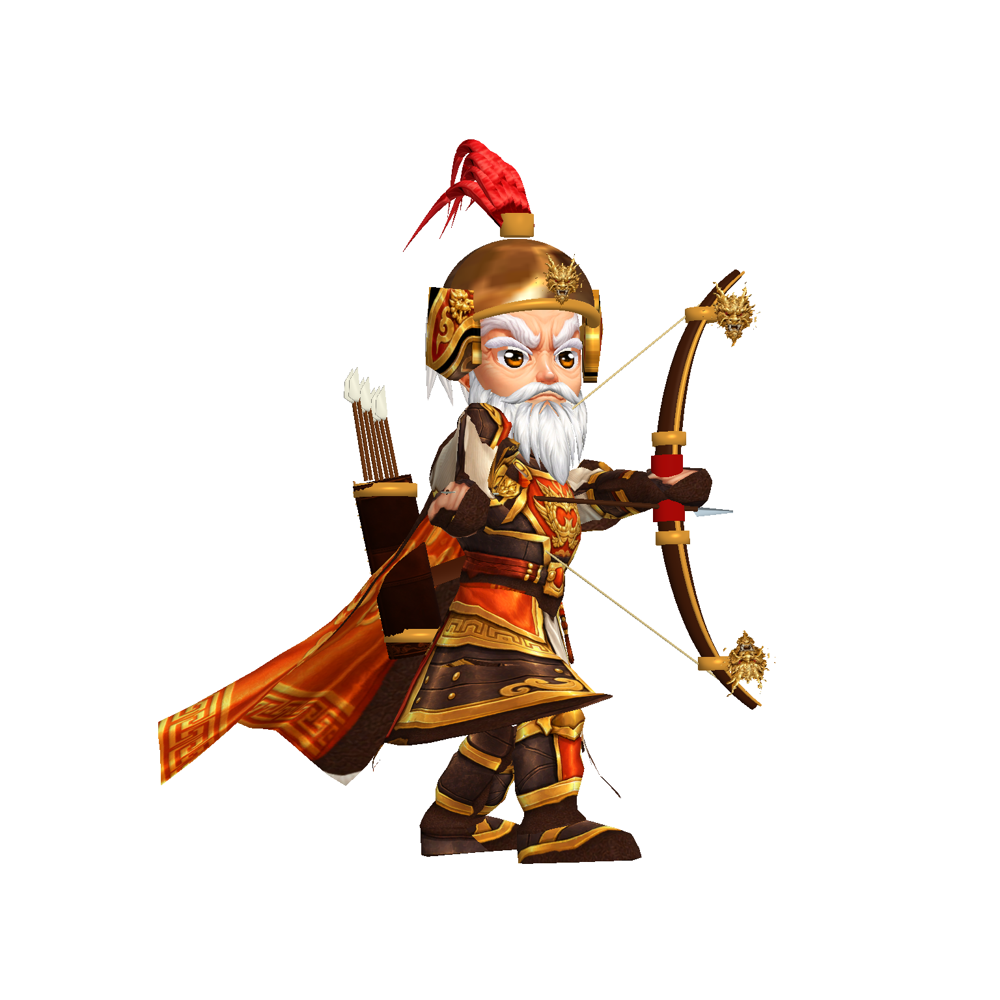
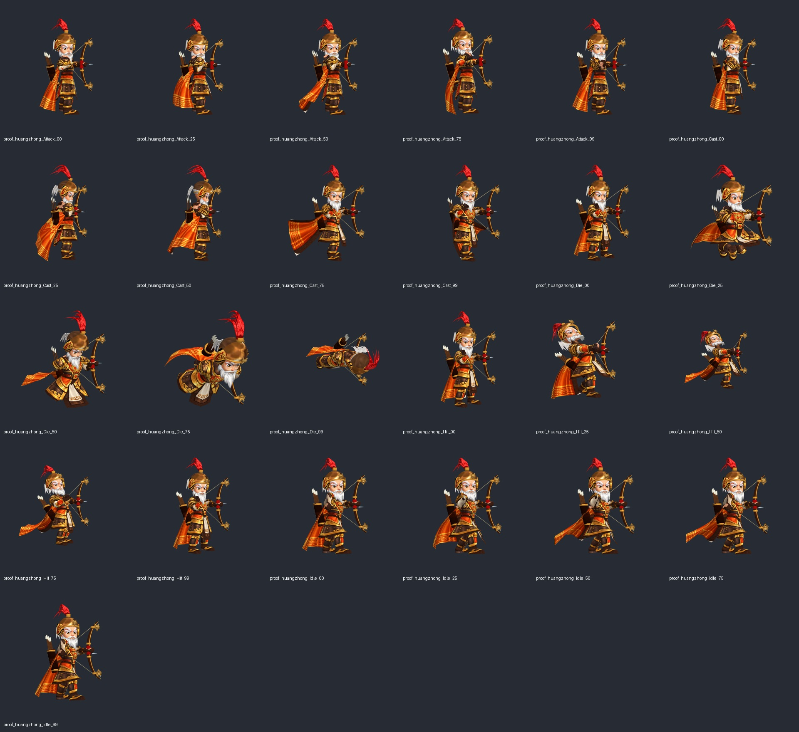
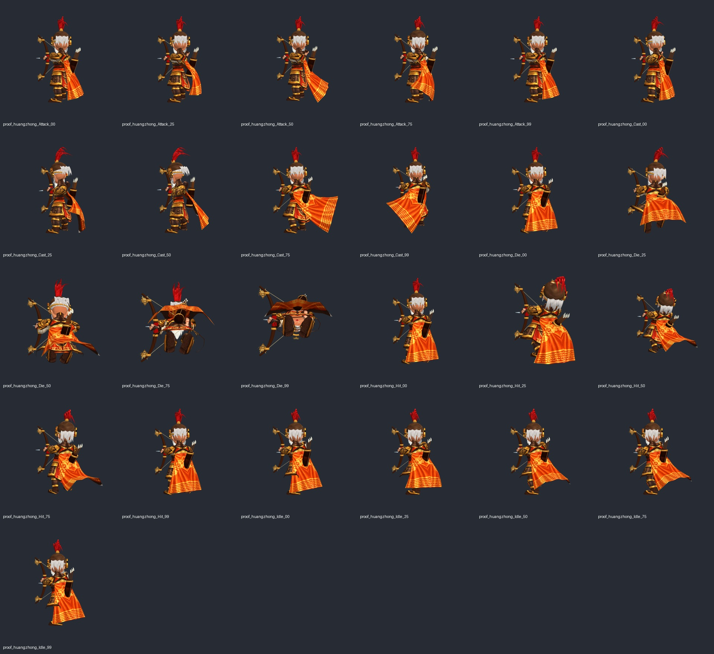

# 黃忠第十六階段：弓手造型與動作素材

2026-10-09。此階段是可運作的美術改進，**尚未通過商用美術驗收**，不能計入「剩餘全部角色已完成」。

## 實際製作與底材

- 保留專案原 Body_00025、Face_00025、Cosmetic_00025 的蒙皮網格與骨架；衣甲、臉、鬍鬚貼圖以原 UV 底材重製。原頭髮與持槍附件移除。
- Codex 新建銀白背髮、青銅盔、金邊護頰、紅纓、複合弓、龍首浮雕、雙段弓弦、箭筒、箭羽、縫線與扁平皮帶網格。金色龍首採貼圖驅動起伏網格，並非完整立體龍頭雕刻。
- 頭盔使用新建 UV；不把自由重排的生成 atlas 直接套回原頭盔。白髮另用縱向纖維貼圖，避免鬍鬚 atlas 在髮束上形成橫紋。
- 原 Idle／Attack／Cast／Hit／Die 分別存為 ArcherSource 素材，再烘焙持弓手臂、箭矢與弓弦曲線；保留原身體與披風動作。沒有增加執行期 IK 或遊戲規則。
- 正式資產：`client/Assets/Resources/ProductionCharacters/huangzhong.prefab`；Textures 中 `huangzhong_*`；Meshes／Materials 中 `Huang*`；Animations 中 `huangzhong_*`。
- 製作工具：`ProductionHuangZhong.cs` 與 `ProductionArcherAnimation.cs`。貼圖生成紀錄見 `huangzhong-stage16-prompts.json`。

## 功能與取景驗證

隔離 Unity 複本建置，正常四角實機圖：`build/model-quality/huangzhong-stage16-v6/`。五個動作各取 0／25／50／75／99% 的五個姿勢，每個姿勢四角，共 100 張：`build/model-quality/huangzhong-stage16-motion-v6/`。

全部擷取完成，未記錄執行期例外；104 張圖皆非空白且未觸及畫面邊界。此檢查不判定穿模、造型品質或使用者美術認可。定格 Prefab 與 ProofScratch 動畫僅存在 build 隔離專案，未接入正式 Resources。

## 人工美術檢查與未完成項

- 已修正黃忠拿槍的職業錯誤；現在有橙金衣裝、老年皺紋、白眉白鬍、持弓與箭筒。
- 已修正頭盔錯取紅纓貼圖、浮雕法線抵消、皮帶圓管輪廓、箭筒誤用披風整體邊界造成的懸空。
- **仍須精修：** 背髮根部與紅纓分束過於規律；盔頂面缺少關羽基準的細緻金屬雕紋；袖口與部分 UV 接縫需要校正；倒下後披風與箭筒仍有相交，必須處理披風曲線或附件避讓；手指與弓弦的接觸仍需近看驗收。
- 全動作圖已檢查大型兵器位置與輪廓，但施法與死亡仍沿用原動作風格，後續需要專屬弓手表演，而不是把待機動畫貼到其他動作。
- 尚未獲使用者認可；此 commit 描述實際造型與素材製作，不描述為商用完成。

## 實機證據

