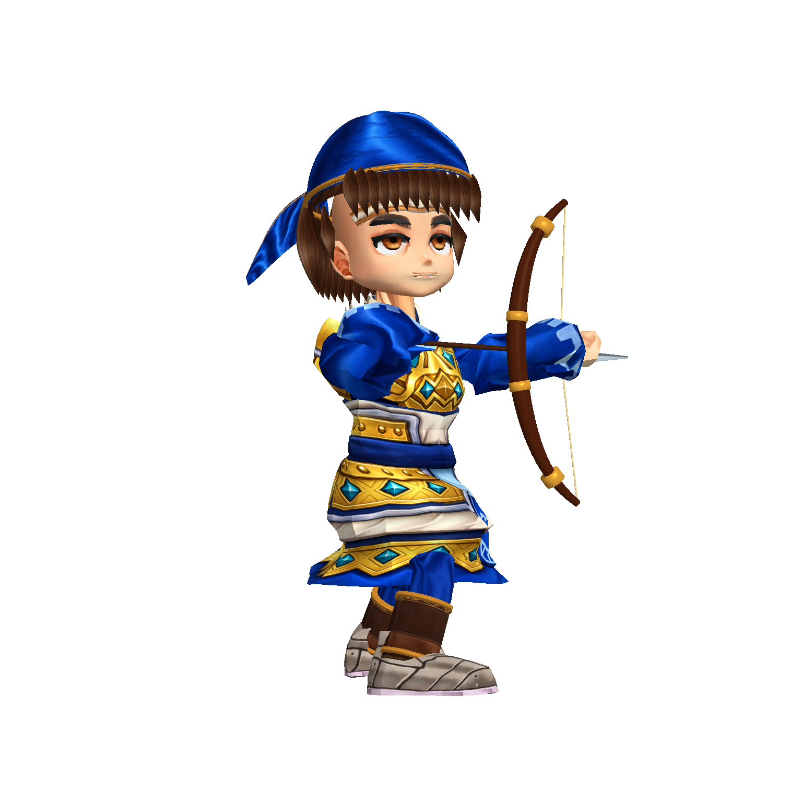
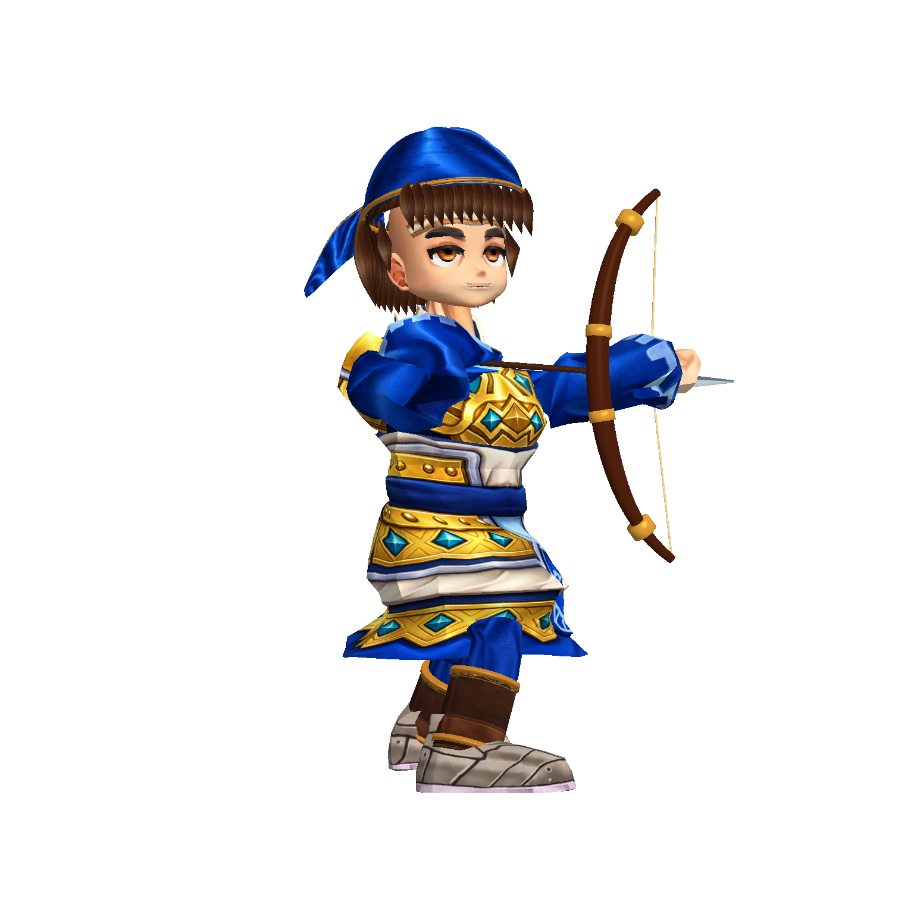
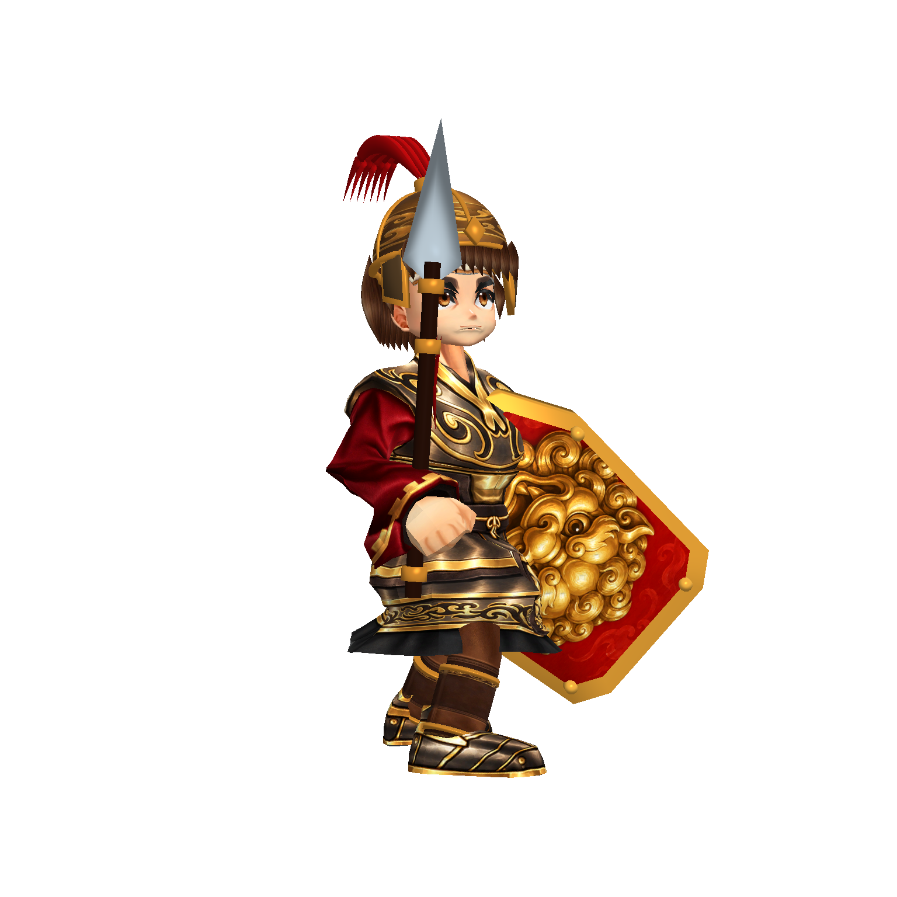
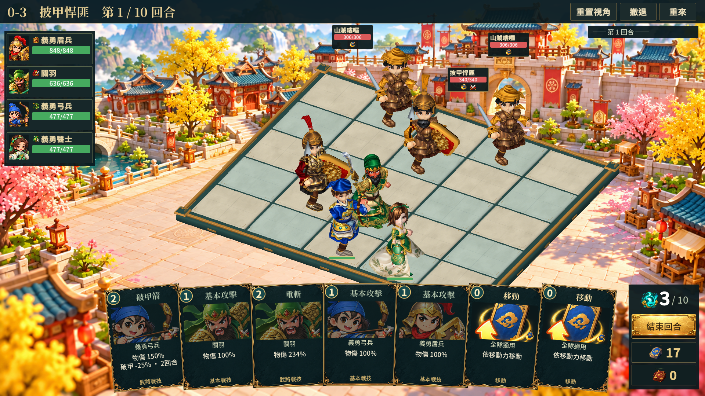

# 弓兵與盾兵比例修正：第十三階段

使用者近照指出兩個角色仍像大頭寶寶。前一輪移除的是額外頭部放大，底材本身仍有頭飾量大、肩胸窄的比例問題。本階段直接修改兩個兵種的模型比例。

- r_shield、r_archer 的 HeadScale 改為 0.80；頭部、髮型、頭盔／頭巾跟隨同一頭骨一起縮小，沒有只縮臉留下大帽子。
- 實際修改 BodyRenderer 的肩胸頂點：依脊椎／鎖骨權重與高度平滑遮罩，橫向最高增加 16%、胸背厚度最高增加 8%。這是局部網格變形上限，不代表整個角色寬度增加 16%。盾兵修改 2,973 頂點，弓兵修改 3,004 頂點。
- 保留 UV、蒙皮權重及各動作引用；頭部比例透過既有播放路徑同時作用於待機與攻擊。整體重新正規化至既有 2.30 蒙皮身高，胸肩與四肢相對頭部更有份量。
- ProportionVersion=2 防止重跑累積變形；正式角色 Baker 接入同一製作步驟，舊比例校正工具也保留兩個兵種的新頭部值。

這是在專案既有骨架模型上的比例精修，沒有更換鏡頭或新增遊戲規則。

## 驗證與限制

兩角色各正面、側面、背面、攻擊，共 8 張隔離 Player 截圖。目視檢查頭飾／臉／頸部連接、胸甲輪廓和兵器跟隨。1920×1080 實際流程 34 張，14 次格點與 HUD／文字版面檢查通過，執行期錯誤為 0。SourceIdle／Idle／Attack／Cast／Hit／Die 引用與修改前一致；重跑烘焙後兩個胸甲 mesh 檔案雜湊不變。

本輪驗收僅確認兩個兵種的頭身比例改善與顯示接入。手掌、握持、鞋部輪廓、其他角色造型仍待精修，不能視為整批角色已通過商用終驗。

弓兵修正前（同一模型側面取景）：

弓兵修正後：

盾兵修正後：

實際戰鬥：

