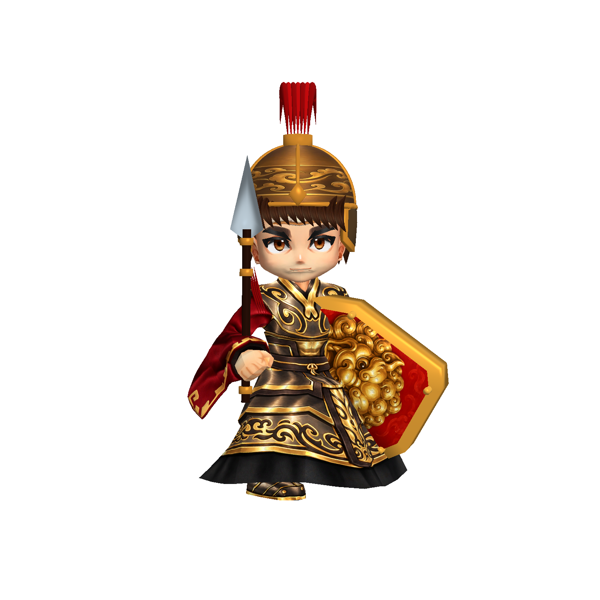
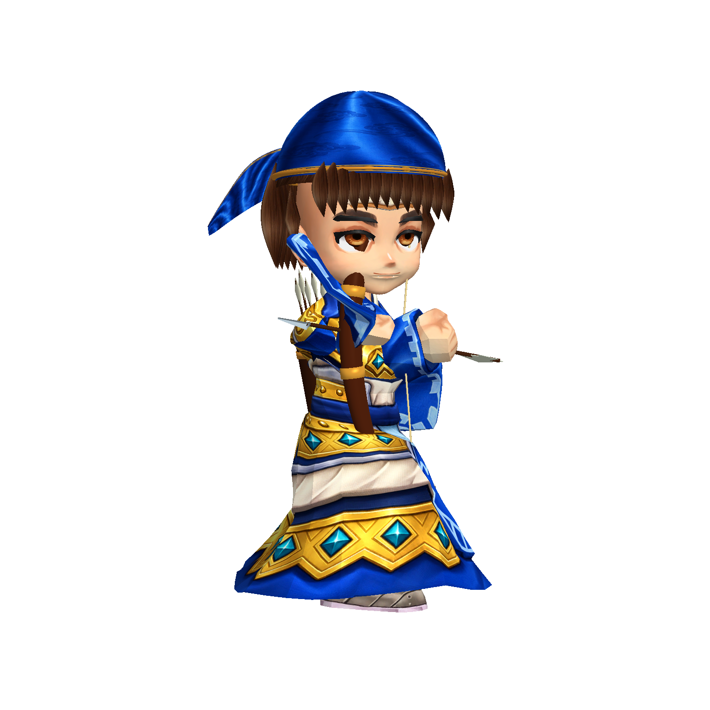
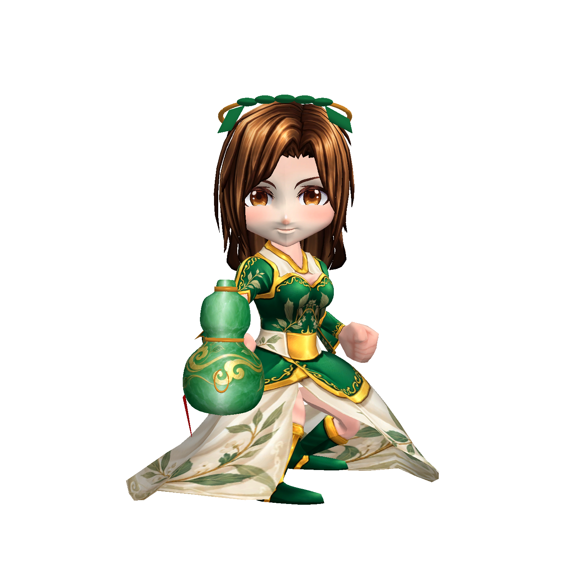

# 鄉勇造型第三階段（2026-10-09）

這是美術階段提交，尚未宣告整體達到商用品質。使用原有骨架與身體底材，重新製作可旋轉的裝備、髮型與 UV 貼圖。

- 盾兵：獨立紅纓盔、護頰、自製短髮、銀色短矛、朱紅金獅盾；身體改為烏金甲與紅衣。
- 弓兵：獨立藍絲頭巾、雙飄帶、自製前後髮束、背箭筒與五支箭；使用男性面部底材與棕色眼睛。
- 醫士：移除原冠飾，棕色髮束、玉飾頭帶、玉綠藥葫蘆與流蘇；重新製作棕色虹膜和柔和臉部貼圖。
- 修正頭飾貼合：以骨骼與 bind poses 計算實際頂點位置，避免 renderer scale 重複計算。髮束端點防止非法頂點，飄帶正反面各自具有法線。頭盔與頭巾的 UV 接縫改至後方並平滑法線。

製作工具：`ProductionInfantryDesign.cs`、`ProductionCharacterBaker.cs`、`ProductionCharacterProps.cs`，全部位於 Editor。沒有改動遊戲功能或執行期程式。

## 實機證據

`build/model-quality/infantry-v6/` 共 12 張 1536×1536 透明模型截圖，含正面、斜側、背面與攻擊。建置及 runtime 檢查通過，沒有空白或碰觸畫面邊缘；這些檢查不代表商用美術認可。

## 未通過項目與下一階段

盾兵、弓兵的來源身體仍呈長袍輪廓，與立繪的短甲裙、褲裝不同；手部仍太方。弓兵的前臂／袖口擋住面部，拉弓手勢需要程式端骨架校正配合。盾牌背面仍可看到袖口穿入，需要改善衣袖網格及握盾姿勢。醫士頭帶與葫蘆的輪廓已修正，但玉葉和手握細節仍需精修。其他具名角色也尚未逐一重製。

下一輪先處理短甲裙、褲裝、靴子與衣袖輪廓，不把 UV 重畫視為整個角色已完成。圖像生成提示與未採用結果記錄在 `infantry-stage3-prompts.json`。
