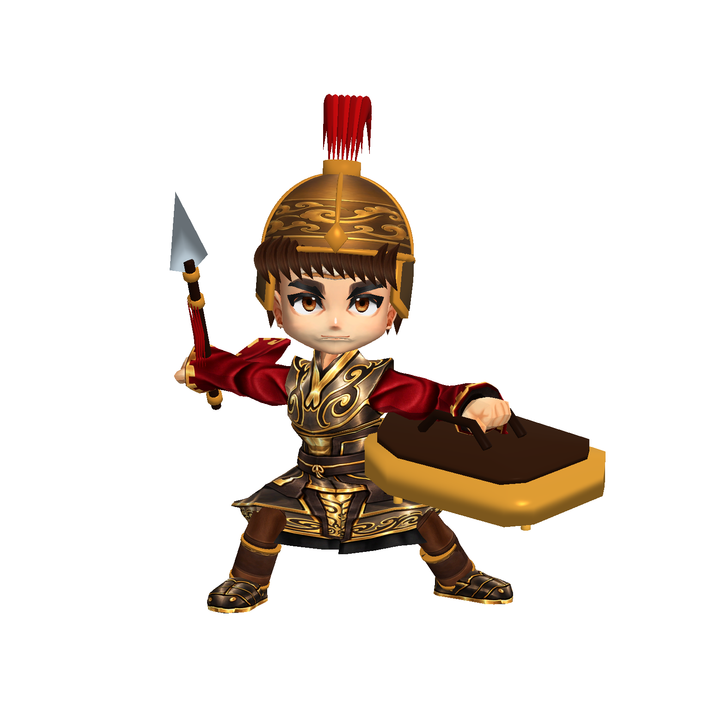
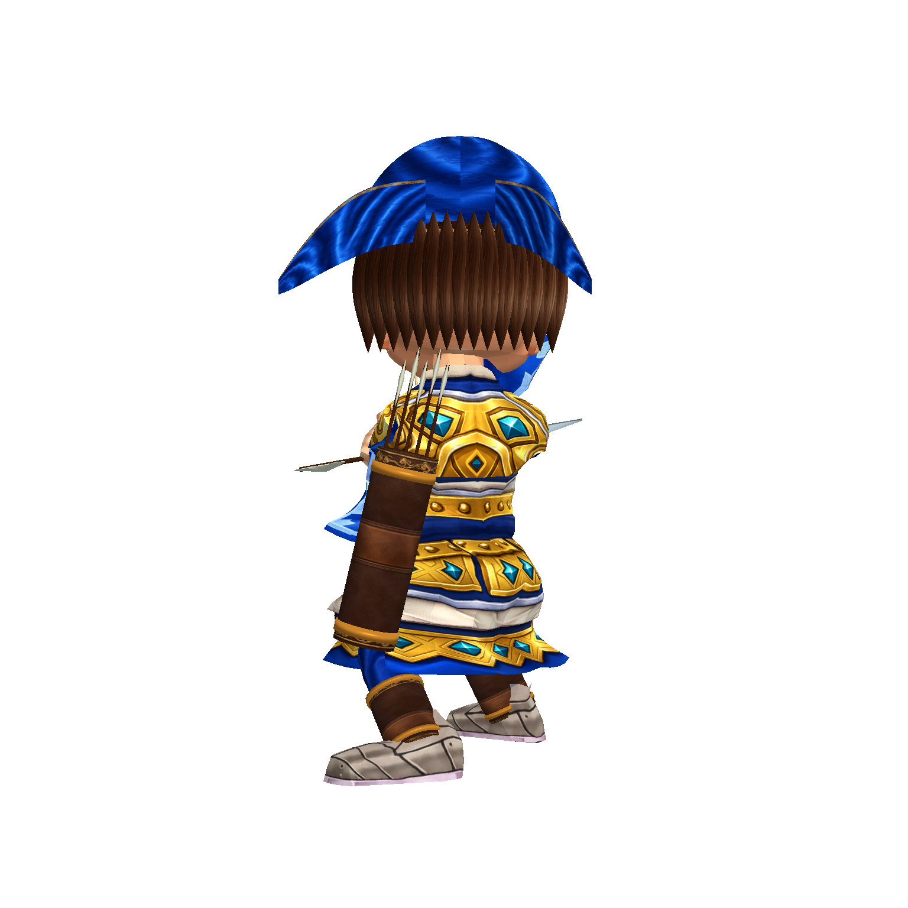

# 鄉勇衣裝第四階段（2026-10-09）

本階段為可追溯的美術製作提交，整體仍未通過商用驗收。

- 盾兵與弓兵：縮短裙甲，補上帶三節骨骼權重的褲管、皮革靴筒與金邊；製作藍布褲料、深棕皮革 UV 貼圖。
- 裙甲依來源 SL／SR／SF／SB 骨骼辨識，不把低垂袖口誤綁至骨盆。保留手臂原有混合權重，修正前幾版攻擊時拉出尖片的問題。
- 模型比例：使用實際引用的頂點、骨骼矩陣與 bind poses，暫時計入執行期頭部倍率後計算身體高度，三名鄉勇統一為 2.3 世界單位。不再採用包含過大來源 bounds 的 Renderer.bounds。
- 同一骨骼、同一表面裝備合併：盾兵 Renderer 數量 81 → 25，弓兵 70 → 22，醫士 22 → 10。這是組件數減少，沒有宣稱整體 FPS 已達效能目標。
- 匯出檢查非法頂點及三角形索引。工具皆位於 Editor，沒有改動遊戲功能或執行期程式。

## 實際驗證

隔離專案重建及實機 `build/model-quality/costume-v7/`，三名角色各四張正面／斜側／背面／攻擊，共 12 張，runtime 錯誤 0。透明輪廓檢查結果另外記錄於該資料夾 `frame-bounds.json`。自動檢查不等於商用美術認可。

## 仍未通過

弓兵持弓姿勢仍擋臉，袖口及手掌還需精修；盾牌背面與手臂的握持關係仍不自然。現行戰鬥劍兵 r_sword 沒有對應的新骨架模型，張飛、山賊的來源造型仍與立繪不符。其他角色尚未採用這次實際頂點尺度規則。同場驗收與其他角色重製必須繼續，不能以本提交宣稱整體商用完成。
