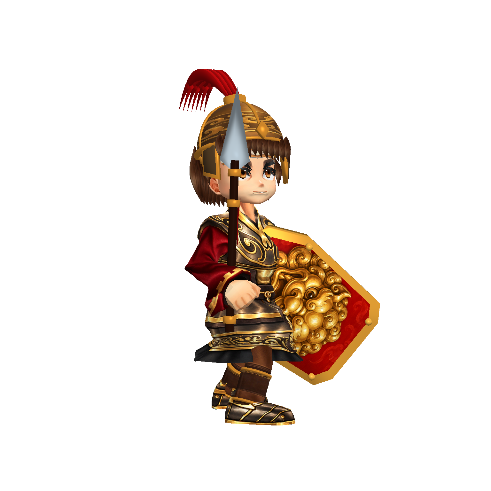
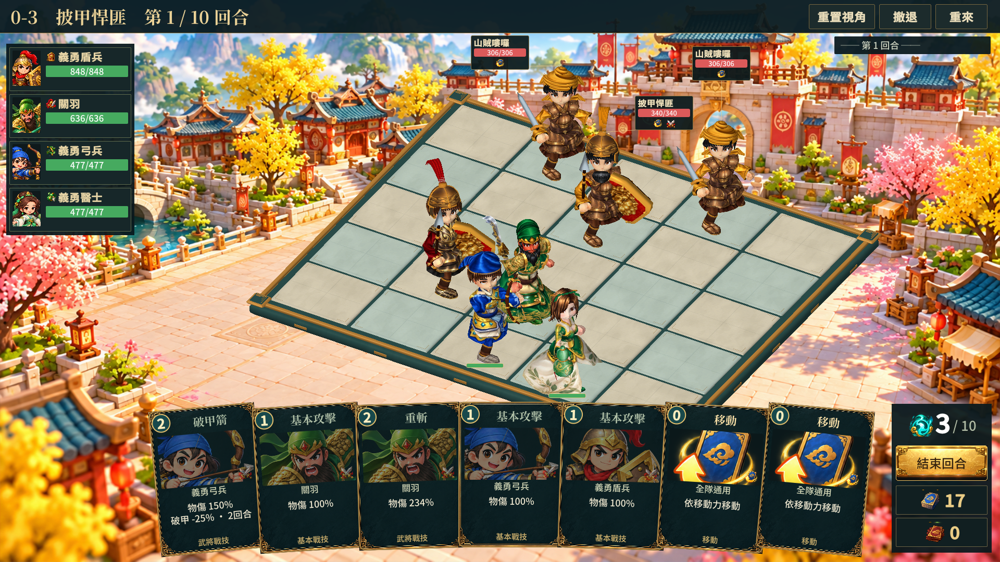

# 待機站姿修正：第十二階段

使用者指出角色仍像低頭縮頸。第十階段只修正尺寸和頭骨間距，未處理待機動畫的頭部俯角及整體屈曲站姿；本階段改製骨架待機動畫。

## 實際變更

- 33 個 ProductionCharacters 各建立 `<ID>_UprightIdle.anim`；保留 SourceIdle 作為重製底稿，重跑由原底稿生成，避免抬頭角度逐次累積。
- 以這組骨架的頭骨 local Y 朝向校正俯角，維持原左右轉向、側傾及輕微呼吸。頭骨朝向抬至水平以上約 9～13 度，胸肩開展 2～4 度；角色眼睛貼圖本身未改動，不把骨架角度等同於眼球視線角度。
- 減少待機腿部屈曲、適度提高骨盆；雙腿逐幀求解並保留原腳部位置及朝向。提升幅度依兩腿可達長度限制，避免站直後腳離地或拉長腿骨。最終烘焙檢查所有取樣幀的落腳誤差。
- 頭頸比例沿用第十階段移除額外頭部放大的成果，但收回過大的頸長延伸：盾兵／弓兵 35% → 12%，其他近戰 20% → 8%，醫士等施法角色仍為 0。
- 新姿勢是 Editor 烘焙的動畫資產，沒有額外加入執行期 IK。攻擊、施法、受擊與倒下動畫引用維持原值。角色重製 Baker 也接入相同的待機姿勢製作流程。

在專案既有骨架和動作底稿上的姿勢重製，不是全新從零製作的模型。鏡頭角度與棋盤格距沒有改動。

## 驗證

隔離 Unity Player：關羽、盾兵、弓兵、醫士、張飛各正面、側面、背面與攻擊，共 20 張；沒有裁框、空白或執行期例外。目視重點是下巴與衣領關係、側面頭頸、胸肩及待機姿勢。

1920×1080 與 1366×768 各 34 張實際流程截圖，共 68 張，包含戰鬥待機、不同動作、最大縮放、擁擠戰場及敵我詳情。每種解析度 14 次格點射線／HUD 容器／文字容納檢查通過，執行期錯誤為 0。33 個 Prefab 的 Attack／Cast／Hit／Die 引用與主專案修正前一致。

33 個候選完成烘焙，重點目視驗收為上述 5 個代表角色及戰場可見角色；不等於所有造型都通過商用終驗。手部、握持兵器、部分披風與衣裝仍待精修。

修正前：

修正後：

實際戰鬥俯視角：

