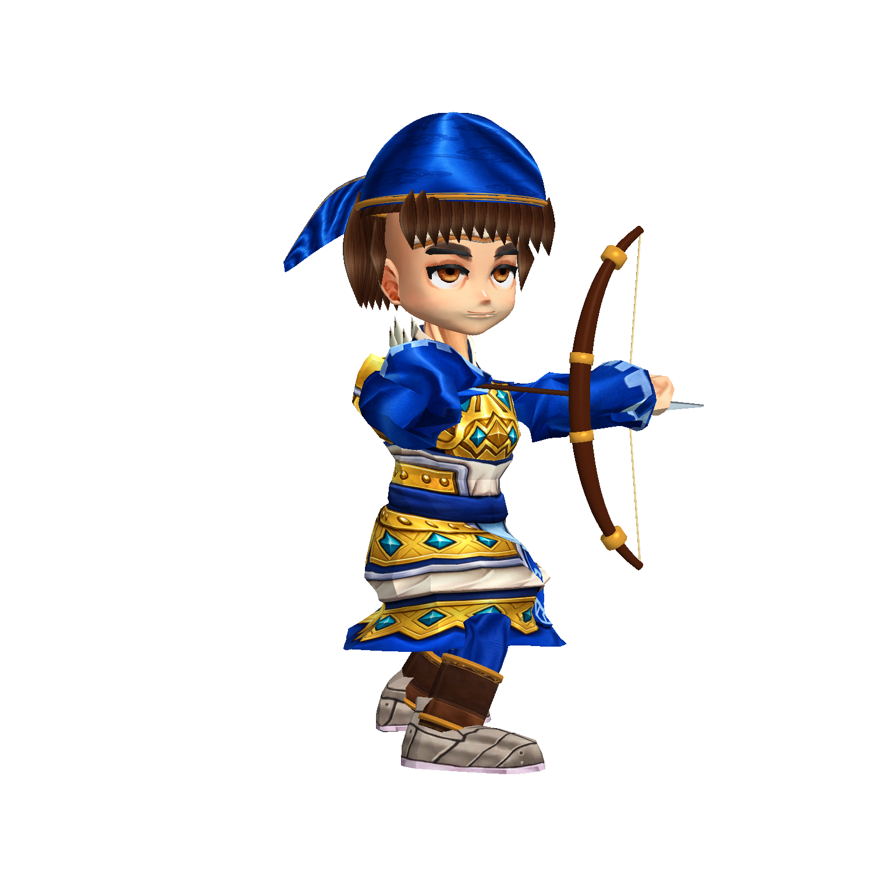
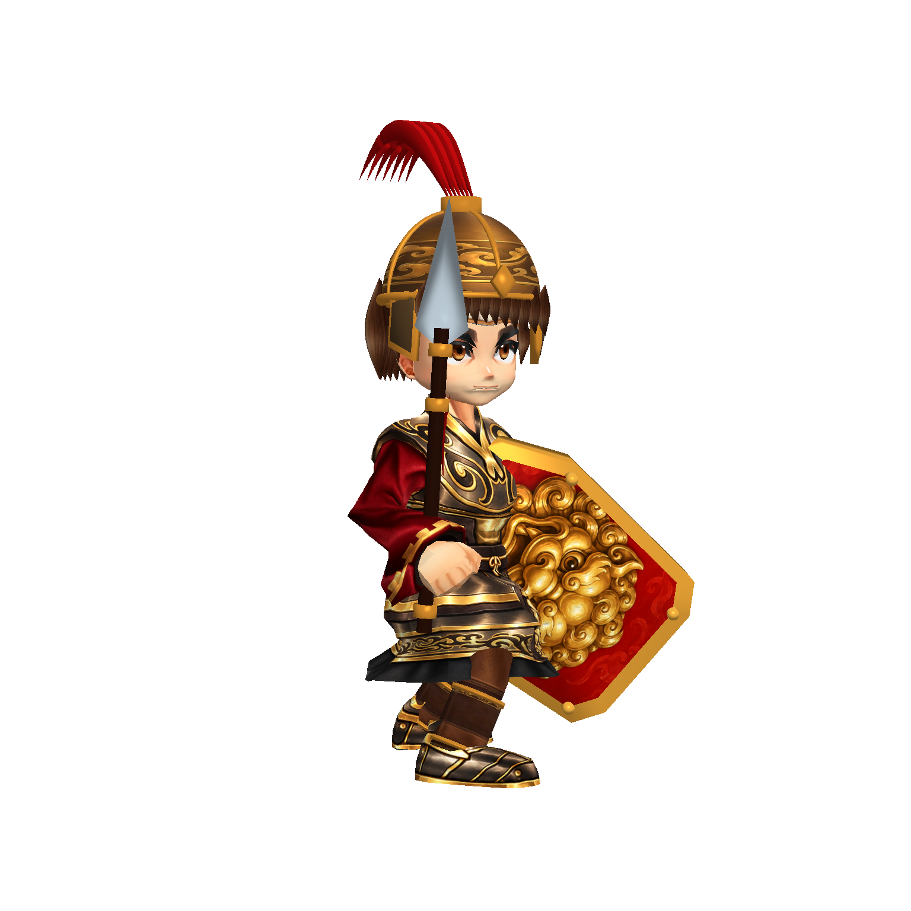
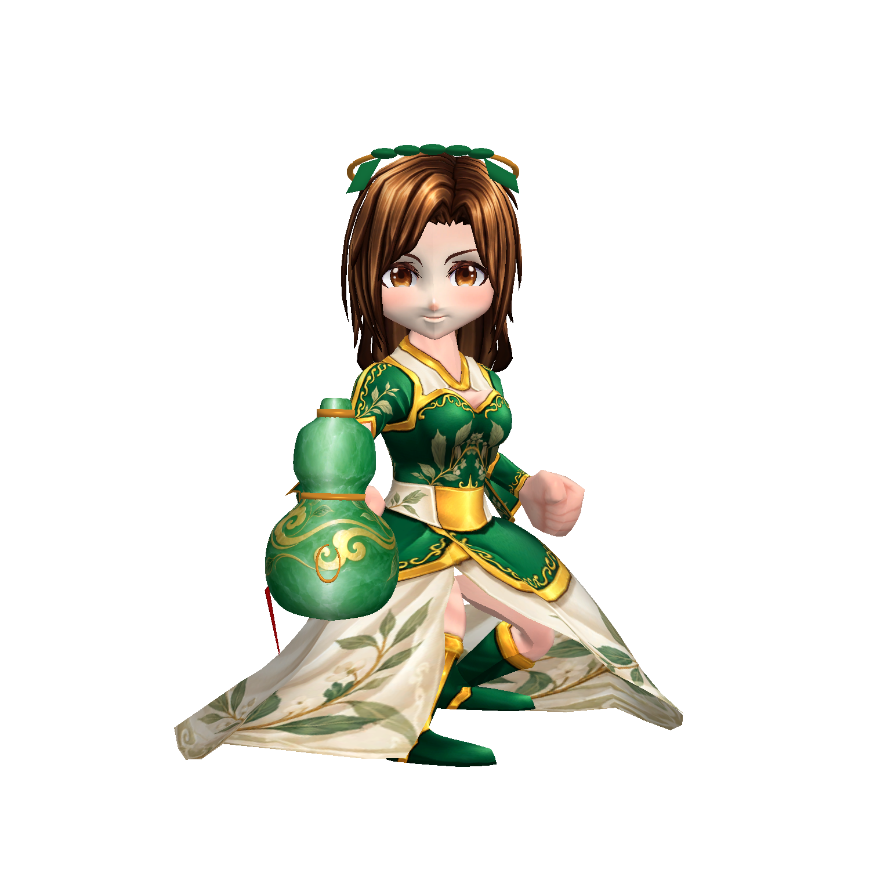

# 頭頸比例修正：第十階段

使用者指出戰場角色頭大、頸部內縮。本階段撤除底材之上額外的 1.22／1.26 頭骨縮放，以及 FaceRenderer 的 6% 加寬；保留原有 Q 版造型。

短頸的盾兵與弓兵將既有頸至頭骨間距延展 35%，近戰其他角色為 20%；施法角色保持原頸長，避免醫士被拉成長頸。頭骨位移透過既有蒙皮連續拉伸頸部，頭髮、帽盔與掛件跟隨頭骨。戰場 CharacterView 與 ModelStage 使用同一資產参数；動畫評估前撤回上幀偏移，評估後再套用，避免無位移曲線時逐幀累積。

33 個 ProductionCharacters Prefab 完成遷移；版本標記避免重複縮窄面部，並按實際蒙皮邊界重新正規化到身體高 2.3。重製 Baker 也採用新比例，後續烘焙不會恢復舊的大頭倍率。這是在專案既有骨架底材上的美術精修，並非全新從零製作的角色。

## 驗證

- 隔離 Unity 建置成功；5 個代表模型（關羽、盾兵、弓兵、醫士、張飛）各正面、側面、背面與攻擊共 20 張真實 Player 渲染。
- `tools/inspect-model-captures.py`：20 張，裁框接觸為 0；Player 記錄沒有例外或 Shader 錯誤。
- 目視確認盾兵與弓兵下巴和衣領間距、帽髮跟隨、醫士原頸長、攻擊時比例持續套用。
- 全部 33 個模型完成資料遷移，不等於逐個已完成美術驗收；本次重點目視驗收為以上 5 個模型。完整戦場取景、血條與棋盤接入另見後續階段。

手部拓撲、持械貼合、部分角色衣甲和披風仍需精修；本階段修正不宣稱整組已達商用終驗。
