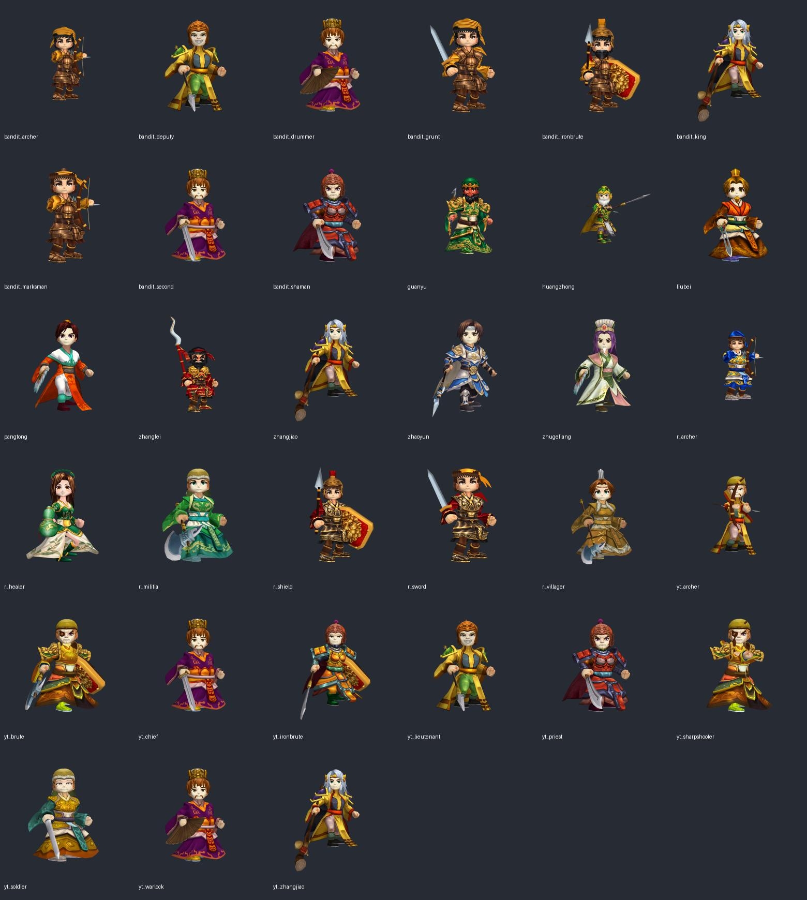
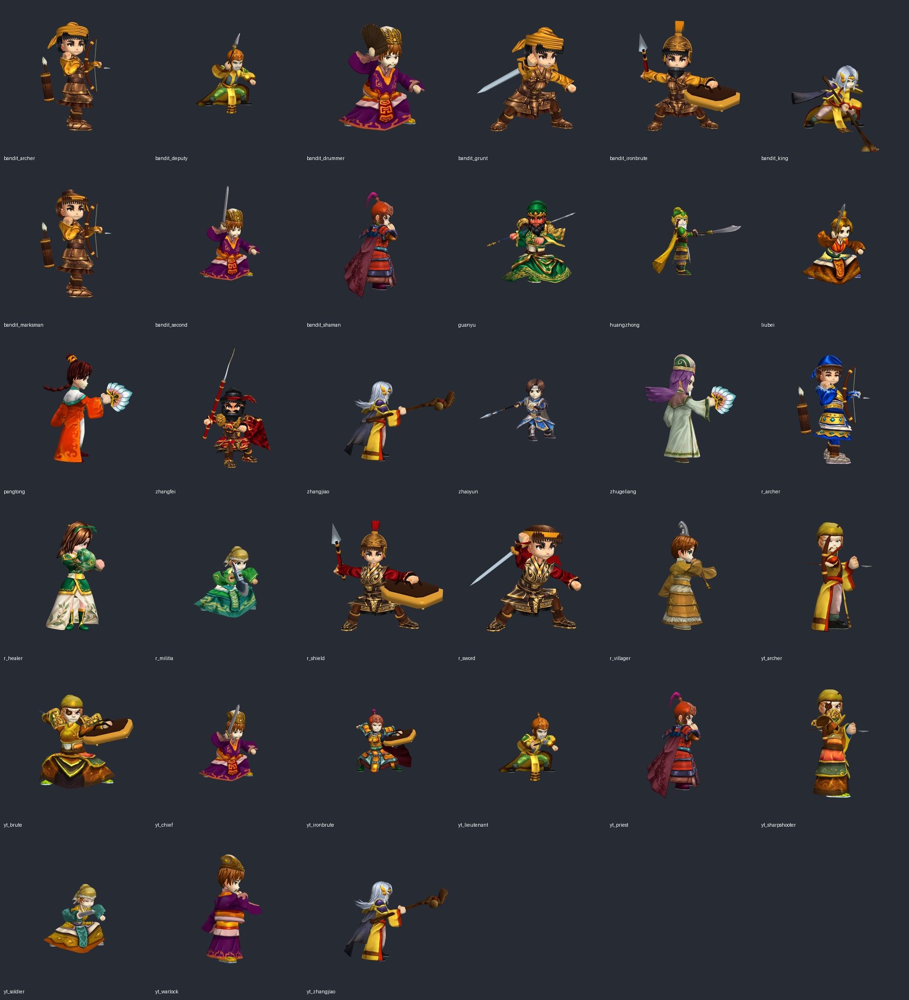
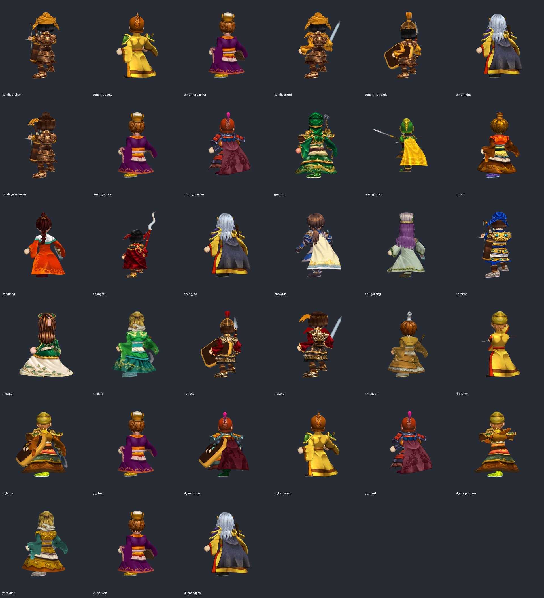

# 第十四階段：33 名角色逐角度基線審查

2026-10-09。基線來源為第十三階段 Windows 驗收版本（2e4ffe6）；本階段沒有將功能通過視為美術完成。每名角色正面、三分之四、背面、攻擊各一張，合計 132 張；完整原圖與 player.log 位於 build/model-quality/stage14-baseline 下四個兵種資料夾。接觸表是實際 3D 渲染的縮圖，不是設計示意。

關羽人物品質依使用者認可作基準：清楚的面部與鬍髮、衣甲分層、具名輪廓、細緻貼圖。人物認可不包含尚待修正的握刀。其餘 32 名均仍待逐角色美術完成與驗收。下表是基線缺口，不能解讀為修改已完成。

| ID | 造型、材質、比例缺口 | 兵器／動作缺口 |
| --- | --- | --- |
| guanyu | 人物已認可，保留 | 刀刃朝肩後、握法與长柄比例需重製 |
| zhangfei | 已有獨立獅甲、鬍髮；精度與關羽一致性仍待檢查 | 蛇矛握持、攻擊與披風穿插需全時序檢查 |
| zhaoyun | 現有藍銀甲、長髮底材需独立精修 | 槍的握持與長度、雙手支撐需重製 |
| huangzhong | 頭盔、鬍鬚與老將辨識需重製 | 基線持槍，必須換弓、箭、箭袋及射擊 |
| liubei | 面部、冠與橙色長袍需對齊人物設計 | 單劍底材，雙股劍與握法需重製 |
| zhugeliang | 紫髮與冠袍為底材，需独立人物設計 | 羽扇、施法袖口與手部需檢查 |
| pangtong | 紅髮與年輕面部底材，辨識不足 | 扇與動作需重製 |
| zhangjiao | 與 bandit_king、yt_zhangjiao 共外觀 | 法杖為既有底材，需獨立法術姿勢 |
| r_archer | 已改頭身與胸肩，袖口與箭袋仍需品質複核 | 持弓／射擊已有動畫，需逐幀複核 |
| r_shield | 已改比例與頭盔，甲片與面部仍需複核 | 盾牌背板、前臂與攻擊姿勢需複核 |
| r_healer | 綠白衣裝與葫蘆已有重製，髮型衣裙需複核 | 葫蘆與袖口、施法／受擊／倒下需檢查 |
| r_sword | 紅黑金甲已有獨立部件，面部與甲質需複核 | 劍握持與全動作需檢查 |
| r_militia | 綠袍底材，仍需步兵獨立輪廓 | 彎刀底材與姿勢需重製 |
| r_villager | 黃袍冠飾底材，村民辨識不足 | 扇狀道具需換為村民道具 |
| bandit_grunt | 已有皮甲頭巾，輪廓細節需複核 | 劍與袖口、全動作需檢查 |
| bandit_archer | 已有頭巾皮甲與箭袋，細節需複核 | 弓與箭動畫需逐幀複核 |
| bandit_marksman | 已有獵戶髮型與箭袋，與弓兵區別仍可加強 | 弓箭動畫需逐幀複核 |
| bandit_ironbrute | 已有盔鬍皮甲，重甲力量感不足 | 盾矛握法與背板需複核 |
| bandit_deputy | 黃綠袍底材，副將身分辨識不足 | 短兵器與攻擊需重製 |
| bandit_second | 與 yt_chief 共紫袍底材 | 劍與職業動作需重製 |
| bandit_drummer | 紫袍扇底材，缺鼓手輪廓 | 沒有鼓、鼓槌與擊鼓姿勢 |
| bandit_king | 與張角共白髮長袍底材 | 頭目兵器與動作需独立重製 |
| bandit_shaman | 紅甲劍底材，術士辨識不足 | 術士道具與施法需重製 |
| yt_archer | 黃衣頭巾底材，袖口與髮鬚需精修 | 現況持杖狀武器，須換弓箭 |
| yt_sharpshooter | 黃巾金甲底材，與 yt_brute 太相近 | 現況持近戰刀，須換弓箭 |
| yt_brute | 黃巾金甲底材，與射手共輪廓 | 刀盾握持與手臂需重製 |
| yt_ironbrute | 紅金甲底材，重甲厚度不足 | 劍盾與動作需重製 |
| yt_soldier | 黃綠衣袍底材，兵卒輪廓不足 | 劍與全動作需重製 |
| yt_lieutenant | 與山賊副將共黃綠袍底材 | 短兵器與領軍動作需重製 |
| yt_chief | 與山賊二當家共紫袍底材 | 首領兵器與動作需獨立重製 |
| yt_priest | 與山賊術士共紅甲劍底材 | 須換祭司道具與施法 |
| yt_warlock | 與山賊鼓手共紫袍扇底材 | 法器與施法姿势需重製 |
| yt_zhangjiao | 與張角共白髮袍底材，須確認戰鬥版本差異 | 法杖握持與全動作需独立檢查 |

## 證據與限制

這些圖只顯示待機與攻擊的一個時間點，沒有完整證明施法、受擊、倒下品質，也沒有證明全動畫不穿模。後續每個角色需補完整時序與手部接觸檢查，並逐階段提交實際修改。

新建置首次因沙箱內 Unity Package Manager IPC 失敗；提升權限後隔離 character-copy 建置已可運作。程式協作者的 src/、tests/ 與 tools/playsim/Program.cs 沒有納入此美術提交。
