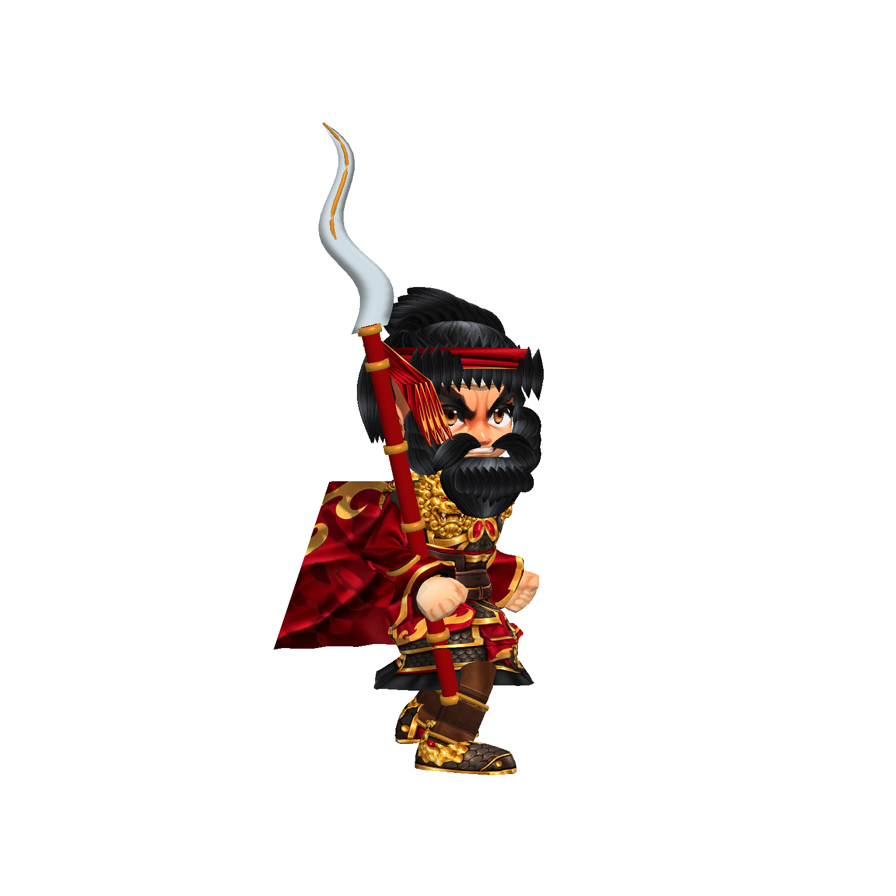
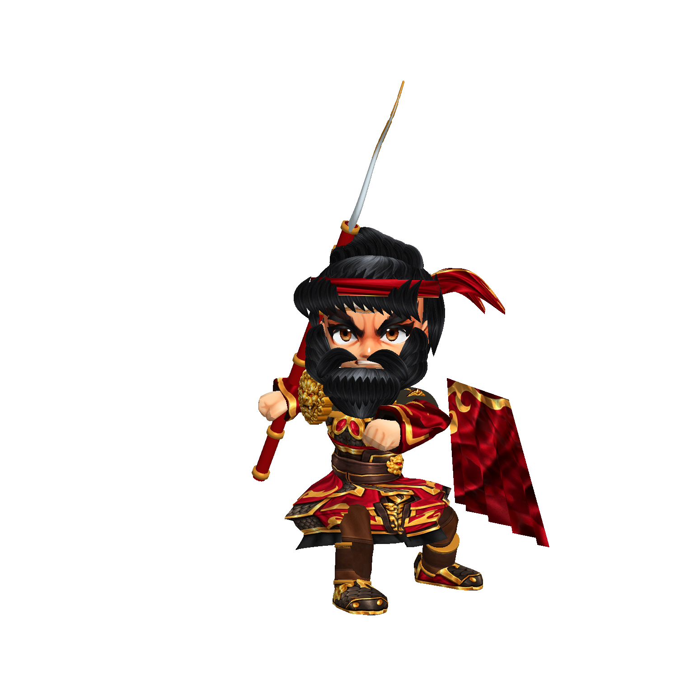

# 張飛裝備第九階段（2026-10-09）

新增立體肩甲殼、金属嵌邊、獸首浮雕和前臂護甲。第一輪光滑玩具造型未採用；改製與立繪一致的赤眼金獸 UV 表面，配合封閉浮雕網格，而非只在原身體上換圖。

浮雕由透明輪廓、曲面厚度與表面明暗重建為正背面及封閉側壁，不是完整自由雕刻的獸首。64×64 採樣替代 96×96，降低不必要的細密網格；尚未做目標硬體效能測試。

肩甲初稿跟隨上臂／鎖骨時翻轉，第三輪封閉底部、第四輪改隨軀幹，防止攻擊時露出空洞。護腕縮小與前臂貼合。材質分組合併仍保留骨骼掛點。

## 驗證

`build/model-quality/zhangfei-armour-v4/` 四張正面、側面、背面及攻擊實機截圖；執行錯誤 0、輪廓出框 0。這是装备精修階段，不是整體商用驗收。

手部仍為來源細分網格，披風未有獨立飄動動畫，持矛尚未製作雙手專屬動作；戰場 HUD 與新棋盤接入也仍未完成。未以四張截圖替代完整動作與目標裝置驗收。
