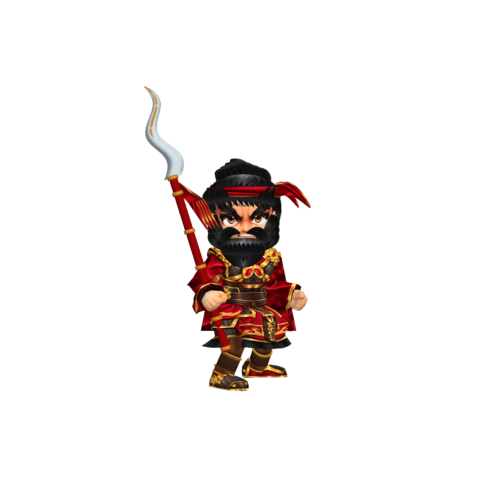
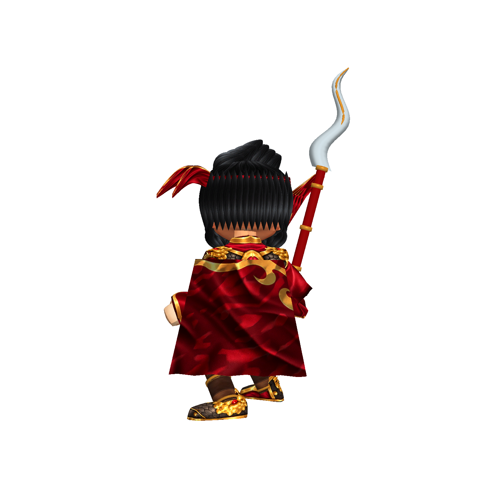
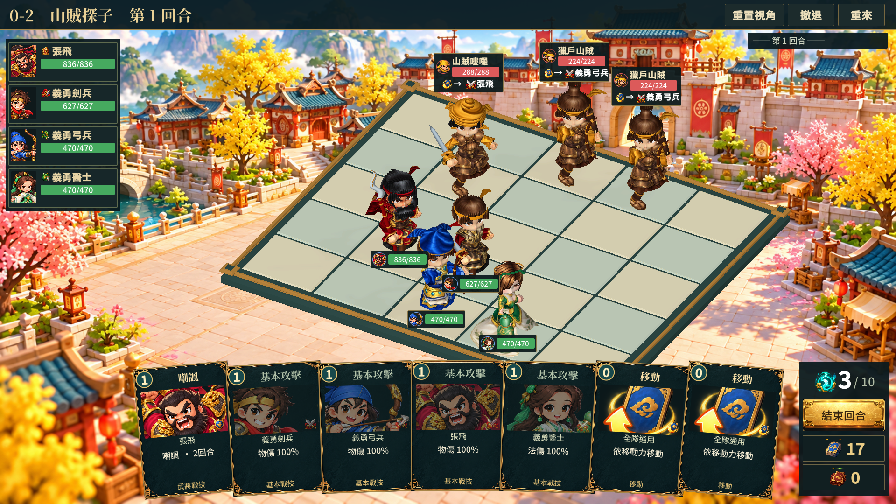

# 張飛模型第七階段（2026-10-09）

本階段解決角色辨識偏離立繪的問題，並非整體商用完成。

## 實際製作

沿用盾兵身體／骨架與鄉勇面部底材，獨立重繪張飛 UV 臉部與黑金紅甲貼圖。移除來源帽型與武器，新增黑髮、弧線髮束、紅頭帶、鬍鬚、八字鬚、兩側鬢髮、紅金披風，以及有厚度與中央脊線的曲刃蛇矛。布料、金属與髮絲使用不同表面材質；裝備跟隨既有骨骼。

張飛底材採用第二級網格細分，保持 UV、權重和原動畫接入；極低細度的原手掌仍需要更完整的獨立建模。攻擊使用來源骨架的長柄兵器動作，與盾兵原攻擊素材不同。披風目前為隨脊柱移動的幾何，尚未製作獨立飄動動畫。

## 驗證

`build/model-quality/zhangfei-v3/` 三名角色共 12 張多角度／攻擊，執行錯誤 0，輪廓裁切 0。第二輪修正第一輪鬚髮的硬折角；第三輪修正蛇矛飄带正面過薄。

`build/model-quality/team-stage7/` 32 張完整 UI 截圖，Player 結束碼 0，執行錯誤 0。已將目前主專案的 Assets（排除獨立烘焙中的 ProductionCharacters）同步至隔離驗證專案；這不是使用者 Editor 的現場操作。

## 尚未通過的商用驗收

張飛尚缺立繪中的立體獸首肩甲、厚實臂甲、完整手部、披風動畫與雙手持矛專屬動作。其他具名角色仍需逐一精修。完整戰鬥中的友軍血條仍遮擋旁邊角色，棋盤缺少石材與雕刻的層次，卡牌底部版面仍偏生硬。這些缺口不因截圖／執行驗證通過而視為解決。
