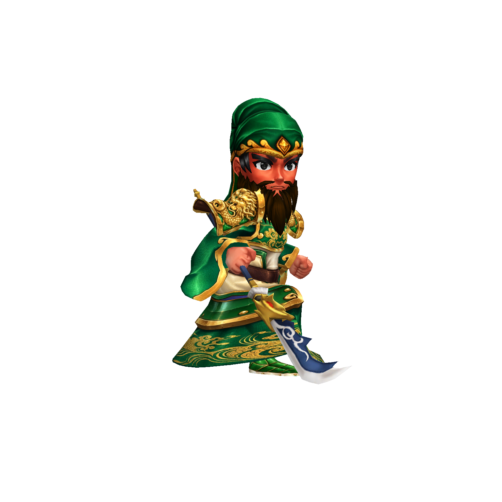

# 角色模型重製階段紀錄

## 第一階段：可驗證的骨架模型樣板

2026-10-09。依使用者要求，由本專案內製作，不採購、不委製。這一階段建立精修、貼圖接入與實機驗收流程；尚未宣稱所有角色達到商用品質。

關羽改用專案已有的 UV 與骨架底材，產生獨立的精修網格。重新製作身體、頭飾與臉部三張貼圖，加入龍紋金甲、青綠織物、紅潤面部與黑髮；修正原貼圖 alpha 為染色遮罩而非透明度的處理。骨架待機、攻擊、受擊與倒下仍保留，新增頭部比例控制。模型與原底材分開保存，方便比較與繼續修整。

此圖由遊戲中的 RenderTexture 輸出，不是 AI 示意圖。身體、頭飾與臉部貼圖透過內建 imagegen 編輯既有 UV 圖集；輸出與提示詞記於 `art-chibi/character-surface-prompts.json`。

驗證：Windows 建置成功，1920×1080 共 31 張頁面與戰鬥截圖，runtime errors 為 0；另擷取關羽正面、側面、背面與骨架攻擊四張 1536×1536 圖。證據位於 `../build/model-sample2/1920x1080/` 與 `../build/model-quality/review/`。

第一階段自評仍待修正：臉型與立繪的一致性、長兵器形狀、鬍髮表面與人物輪廓。這些差距沒有因建置成功而被視為通過。

## 第二階段：戰鬥骨架底材與兵種部件

由專案既有底材產生 32 個獨立的骨架精修候選 prefab，保留 UV、骨骼權重與 bind poses；沒有採購或使用外部付費模型。這些是可以繼續編修的底材，並非 32 個已完成的商用人物。每個角色約 1.8–2.9 萬個三角面（不含新增裝備），關羽由第一階段約 4 萬面降低至 20,620 面。

關羽重新製作黑色鬍髮、金銀兵器表面與棕色虹膜；修正原底圖的小橢圓實際是眼球 UV、不能當成髮片的問題。盾兵、弓兵、醫士各製作一張獨立身體貼圖，分別使用朱紅、藍金與翠綠象牙的材質。金紋的微表面光照是 shader 的近似浮雕效果，不是新的龍紋雕刻拓樸。

新增獨立彎弓、弓弦、箭鏃、尾羽與盾牌網格，掛在實際手骨上。弓兵加入雙臂骨架校正；劍、盾、長兵器、弓與施法者分別使用對應動作，死亡時停止持弓校正。盾牌已修正正反朝向。角色預覽從實際渲染的透明輪廓取景，處理頭部放大與持弓後的出框問題。

驗收仍未通過商用品質：盾兵與弓兵的頭飾、面部、髮型尚未對齊立繪；盾兵仍持有底材的棍棒，醫士的冠飾與道具仍需重製。部分具名角色仍沿用來源外觀，不是完成的獨特角色。未具備來源底材的角色仍使用前一版占位模型。這一階段不把材質改善與功能成功當成角色美術完成。

實機證據：`../build/model-quality/stage3-verified/`（五名角色、每名四個角度與攻擊），`capture-manifest.json`、`frame-bounds.json` 分別記錄 runtime 與出框檢查。另以 1920×1080 跑完 32 張介面及戰鬥截圖，HUD、卡牌文字與重疊檢查通過，位於 `../build/model-quality/stage3-ui/`。Windows 測試版置於 `../build/character-win/`，使用獨立複本，不覆蓋其他工作中的 build。

重跑：`tools/verify-character-models.ps1` 建置與擷取實機畫面；`tools/inspect-model-captures.py` 唯讀檢查透明輪廓是否空白或碰到畫面邊缘。功能檢查和美術認可分開記錄。

## 檔案與流程

- 精修網格、材質、貼圖與 prefab：`../client/Assets/Resources/ProductionCharacters/`。
- 製作工具：`../client/Assets/Editor/ProductionCharacterBaker.cs`，以 Loop 細分修整網格並保留 UV、骨骼權重與 bind poses。
- 材質：`../client/Assets/Resources/Shaders/CharacterSurface.shader`，保留 UV 貼圖、金屬高光、柔和明暗與即時陰影。
- 載入：`HeroArt.Model` 優先載入精修角色；尚未完成的角色保留原版本。
- 實機多角度檢查：遊戲參數 `-sanguoShot <輸出資料夾> -sanguoModelReview guanyu`，使用隔離的截圖模式，不存入一般玩家進度。

後續按照已核定的明亮、精緻 Q 版方向，繼續修整關羽樣板，再拓展盾兵、弓兵、醫士與敵軍；每個可驗證階段直接 commit。
