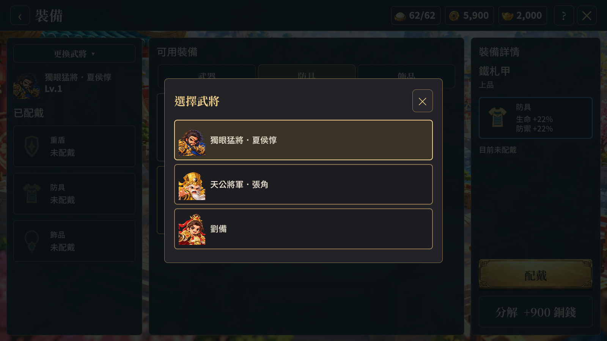

# 裝備頁選人視窗修正（2026-10-10）

使用者回報點選角色後版面崩壞、文字和已配戴欄位重疊。裝備頁原先使用 DropdownField，前次驗證直接設定欄位值，沒有涵蓋展開選單。

本次以頁面內的「更換武將」視窗取代原生下拉選單。每列顯示肖像和武將名稱，標示目前選擇；點選武將會關閉視窗並更新裝備欄位，右上角可取消。沿用既有對話框的捲動區與 Escape 關閉操作。

Unity Windows 建置通過。1600×900、1035×577 各九張畫面，透過控制項提交事件驗證開啟、取消、再次開啟及選擇張角；檢查開啟前後左欄位置尺寸相同、視窗邊界完整、選擇後視窗移除。既有配戴、替換並回收舊裝備、卸下、分解及返回養成驗證通過。沒有新增執行期或樣式診斷。這些是自動操作驗證，未宣稱完成滑鼠端到端測試。

目視檢查兩種尺寸的選人視窗，三欄背景仍保有原版面，武將肖像及名稱未重疊。沒有修改裝備數值、抽卡規則或後端流程。

