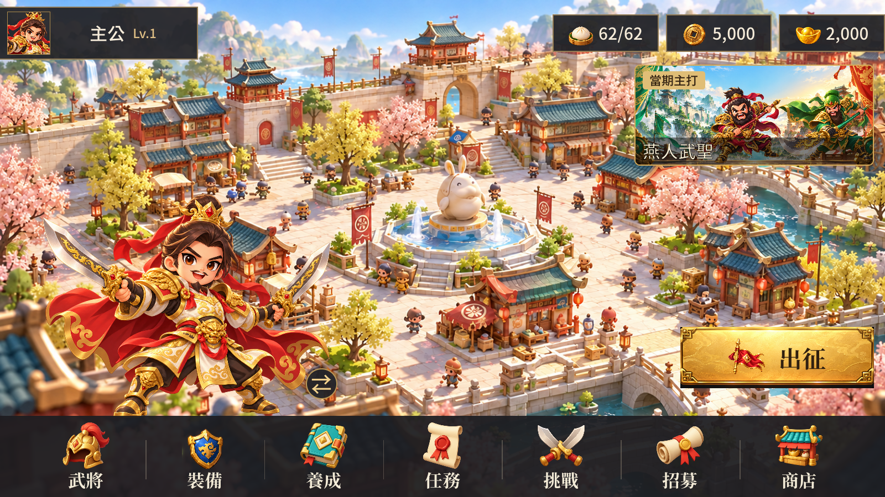
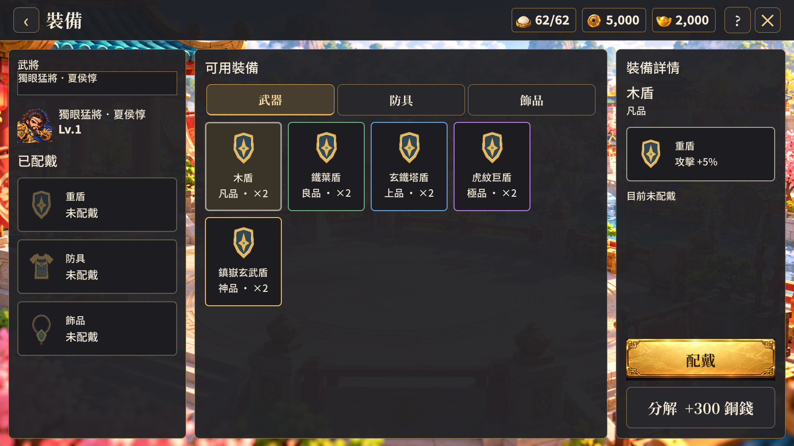

# 獨立裝備頁與主頁七個入口（2026-10-10）

使用者確認將裝備搬至獨立大頁面，並指定主頁順序：武將、裝備、養成、任務、挑戰、招募、商店。

主頁新增裝備大按鈕，圖示使用專案既有 ChibiSkin/armor.png（金邊藍盾），其餘六個圖示沿用既有 HomeArt/Navigation，不宣稱本次新繪。七個按鈕依指定順序排列，仍使用既有深色底欄與分隔線。

EquipmentPage 為獨立頁面：左側切換武將及選取已配戴部位，中間以武器／防具／飾品分類顯示可用庫存格子，右側顯示名稱、品級、實際加成及操作。點庫存後可配戴或替換、分解；點已配戴裝備後可卸下。空庫存有明確提示。養成中的裝備入口導向同一頁，返回養成保留選定武將。從主頁進入時返回主頁。

沿用既有 Equip、Unequip、Dismantle 後端呼叫與裝備規則。新增的選取武將、部位和返回來源只屬 UI 狀態，沒有修改成長、物品、抽卡、裝備數值或持久化規則。裝備圖示沿用上一階段自製的類型圖示；同類型不同品級仍共用圖示，用邊框顏色區別。

## 功能驗證

- Unity 6000.3.25f1 Windows 建置成功，使用獨立測試副本。
- 1600×900、1280×720 各八張裝備／主頁畫面：七入口順序、主頁裝備入口、庫存選取、配戴、替換並回收原裝備、卸下、分解銅錢與庫存變更、切換武將、養成入口與返回保留武將、空庫存、欄位及操作按鈕邊界全部通過。
- 另驗證養成八個產物：預設屬性、四項升級預覽、專屬信物、材料上下排列、突破星數、角色／模型切換、模型非空與置中、列表尾端。
- 測試帳號不儲存；測試工具在明確的截圖模式下設定 LocalBackend 的記憶體內測試資料，正式頁面不存取私有後端欄位。
- 沒有新增執行期例外或 USS 診斷，既有 HomeLayout 的 last-child 警告仍在。

## 美術驗收

目視檢查七按鈕主頁、庫存選取畫面、已配戴／卸下畫面。兩種解析度的三欄版面與操作按鈕完整，品級框、裝備名稱、數量和加成可辨識。沒有製作新模型，不宣稱原有模型與整體美術已達商用品質。

重跑方式：tools/verify-equipment-ui.ps1；養成另用 tools/verify-growth-ui.ps1。測試資料和完整畫面位於 build/equipment-ui-review 與 build/growth-ui-review。
