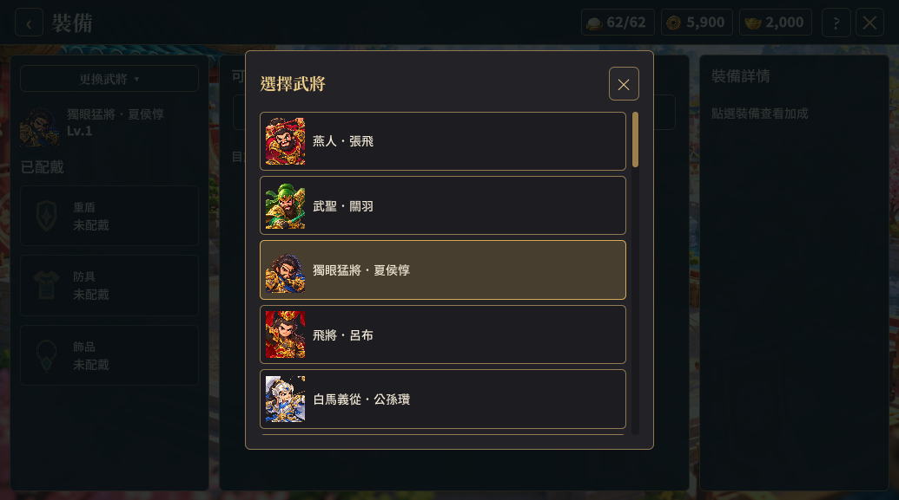
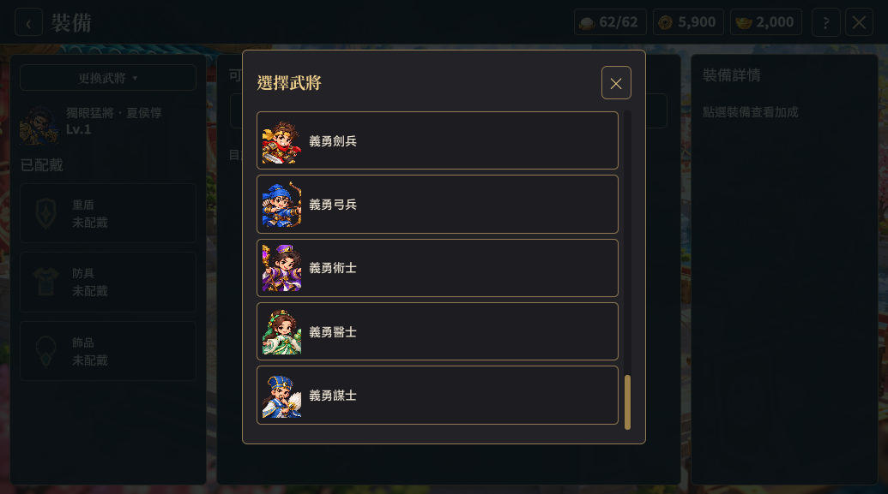
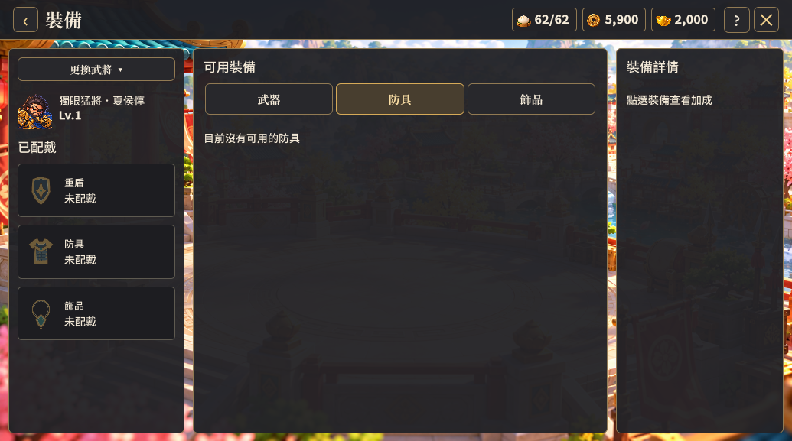

# 選人捲軸與裝備狀態樣式修正（2026-10-10）

使用者回報選人視窗的垂直捲軸異常，以及裝備分頁的懸停、選中樣式不像同一體系。

選人視窗缺少完整的垂直 Slider 軌道與滑塊佈局，之前完整規則只套用在 roster-scroll。這次將軌道、欄寬、Slider 輸入區、滑塊絕對位置與最小高度補到共用垂直捲軸，隱藏兩端箭頭；選人視窗固定至畫面 80% 高度，標題列不參與縮小，列表在獨立視口內捲動。前次只用三位武將驗證選人，沒有涵蓋完整名單，此次補上。

舊版分頁樣式仍設定背景圖片，Unified 的選中樣式只有背景色，沒有清除圖片，因而出現亮橘金框與深色懸停並存。現在清除選中分頁的舊背景圖片，並以深色一般底、較亮深色懸停底、暖深色選中底和金色選中邊框統一裝備分頁、庫存格與武將選擇列。已配戴卡片沿用相同懸停／選中色。未修改裝備或抽卡規則。

## 功能驗證

- Unity Windows 建置成功。
- 1035×577、1600×900 各 13 張產物通過，沿用原有裝備操作及懸停尺寸驗證。
- 使用完整 GameSession.Roster 建立只存在測試記憶體的帳號。檢查滑塊窄於 18 個 UI 單位、軌道涵蓋列表高度、長名單有有效捲動範圍、標題列與視口不重疊。
- 發送 UI Toolkit WheelEvent 與 PointerDown／Move／Up 事件，驗證滾輪與滑塊拖曳確實改變捲動位置；捲到末尾後確認最後一位武將完整可見且能選取。這是 UI 事件測試，不是作業系統滑鼠端到端測試。
- 同版另完成 26 張跨頁面畫面驗證，沒有新增執行期／USS 診斷；保留既有 HomeLayout last-child 警告。

## 美術驗收

目視檢查兩種尺寸的名單頂端、末尾及裝備分頁選中畫面。捲軸在右側形成完整軌道，名單不蓋住標題；選中防具分頁使用暖深色金框。未宣稱驗證每一個頁面的實際捲軸拖曳。

