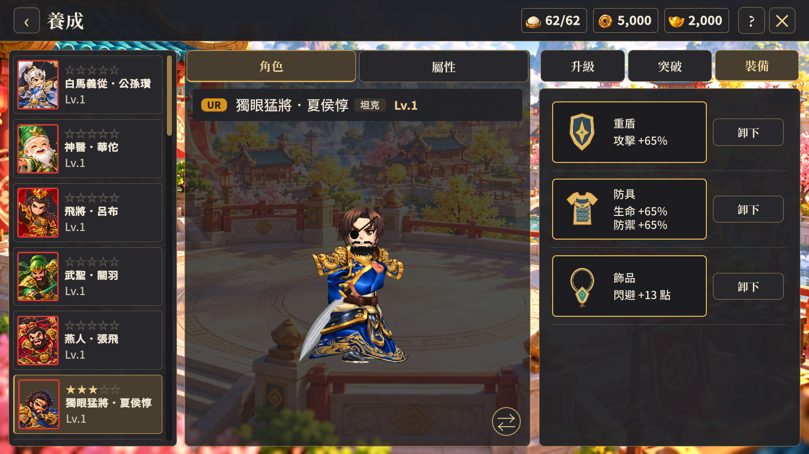
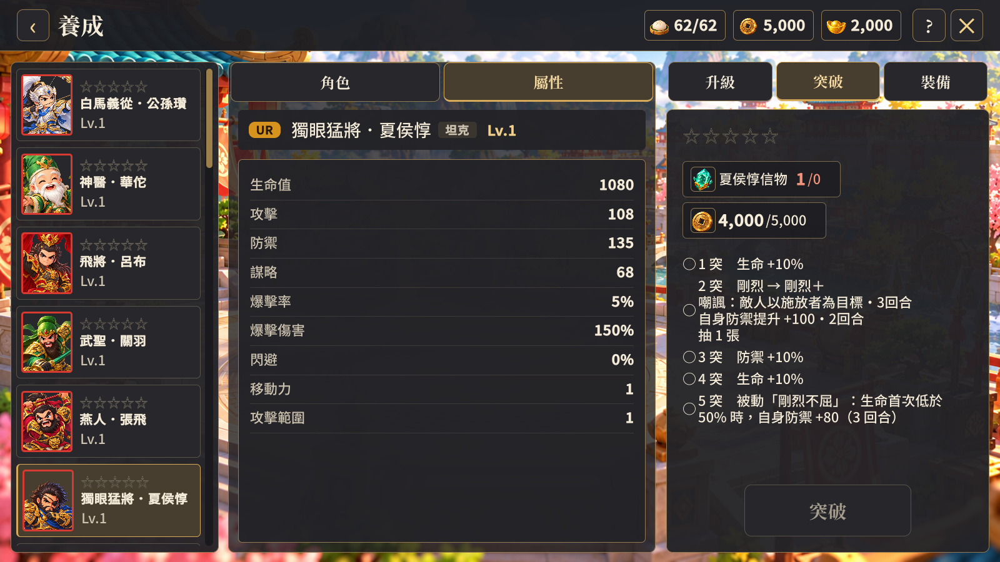

# 養成顯示修正（2026-10-10）

使用者後續更正消耗資源應上下排列，並回報模型偏左裁切、突破信物不明確。本紀錄取代 layout-review.md 中的資源橫排說明。

- 模型容器原本繼承 Pages2.uss 的 translate: -50% 0；現在於養成頁明確設為 0 0，容器置中。
- 升級與突破材料卡改為上下排列，維持各自加框。
- 突破材料卡加上武將專屬名稱，例如「夏侯惇信物」。抽卡重複結果顯示「信物+1」，移除的上方重複武將計數不恢復。
- 沿用現有規則：重複武將產生 1 個專屬信物，突破消耗 1 個信物及銅錢；星數與庫存信物已足夠滿五星後，後續重複武將改為將魂。沒有修改抽卡、突破或裝備規則。

原先模型驗證只檢查元素存在，沒有檢查置中和渲染影像非空，因此未捕捉裁切。此次增加容器中心、畫面邊界及模型 RenderTexture 的有效像素檢查。隱藏測試視窗不會自動更新模型相機，驗證工具額外提交模型相機的渲染要求；不更動正式遊戲的相機流程。

功能：Windows 測試版建置成功；1600×900、1280×720 各 13 張畫面及 1 張模型渲染圖通過，沒有新增例外或 USS 診斷。美術：目視確認人物位於中央且未被左邊裁切、材料上下排列、信物名稱可讀。這次沒有修改模型本身的外觀品質。

裝備獨立大頁面屬於使用者另提出的版型調整，目前待確認配置，未列為本次已完成項目。現有裝備操作為庫存卡下的配戴／分解按鈕，以及已配戴卡旁的卸下按鈕；空槽卡目前不可點選。

