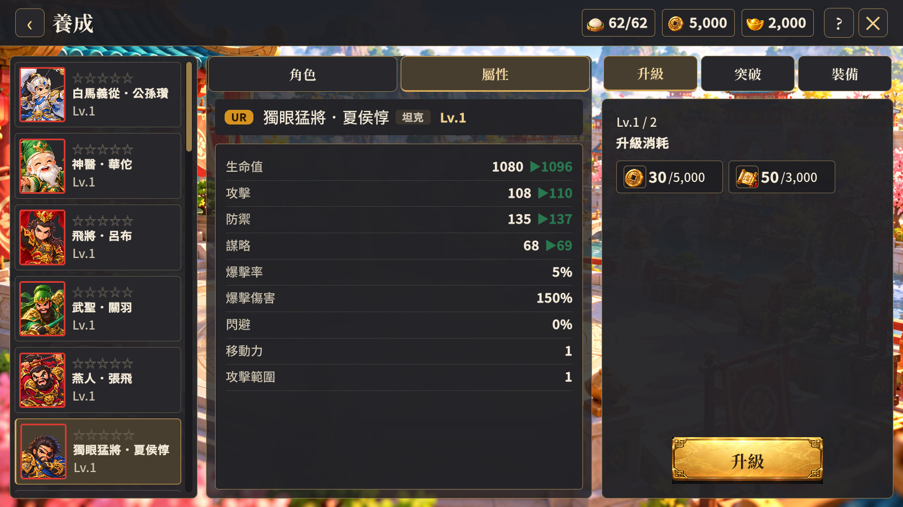
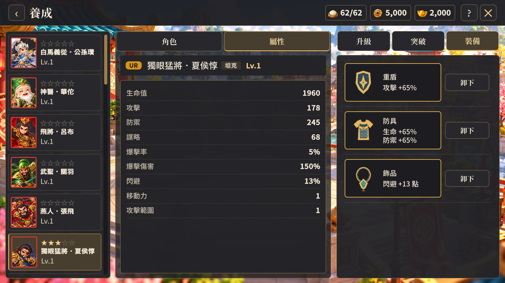

# 養成 UI 版面驗收（2026-10-10）

依使用者標註及後續確認完成中央「角色／屬性」分頁，預設顯示屬性；角色分頁保留既有立繪與模型切換。右側升級／突破／裝備區使用整個可用高度。屬性顯示目前值及可升級時的四項預覽，移除中央屬性頁原本多餘的突破星數。

左側卷軸由 480 縮為 400 個 UI 單位，武將名稱由 22 放大為 24；現有八字名稱可完整單行顯示。突破頂部改為五顆星的進度，移除重複武將數量文字；消耗數量仍保留在材料卡上。

升級與突破消耗橫向並列、各自加框。底部按鈕寬度 260 個 UI 單位，置中。裝備空槽使用淡色部位圖示；已配戴裝備顯示圖示、實際當前加成與稀有度色框。移除效果範圍、可配戴類型說明與庫存為空的文字。配戴、卸下、分解與碎片資訊仍保留。裝備名字及品級保留於提示文字，新增圖示代表類型，沒有為每個名字製作獨立外觀。

## 功能驗證

- Unity 6000.3.25f1 Windows 測試版建置成功。
- 使用獨立 build/growth-layout-client-copy，測試帳號不持久化。
- 1600×900、1280×720 各 13 張養成畫面通過：預設屬性、角色與模型切換、八字名稱、左右欄邊界、消耗並列、三個空槽、目前裝備加成、五種品級及列表尾端。
- 驗證帳號等級 1 的封頂畫面及等級 2 的四項升級預覽；不修改遊戲帳號等級規則。
- 既有武將列表驗證另通過 18 張：武將／養成頁排序、零／三／五星、稀有度框、單行名稱、中段及尾端捲動保留、立繪與模型切換。
- 執行期沒有新增例外或 USS 診斷。現有 HomeLayout 的 last-child 警告仍屬既有問題。

## 美術驗收

已目視檢查兩種解析度的屬性頁，以及裝備、突破、角色切換畫面。名稱沒有截斷，消耗品並列且各自加框；裝備圖示及當前加成可辨識，空槽與五種品級的外框區別成立。新增向量圖示採平面風格，不宣稱模型或整套美術已達商用品質。

素材製作來源與限制見 equipment-icons.md。完整測試畫面存於 build/growth-ui-review，重跑方式為 tools/verify-growth-ui.ps1；需讓 Unity 能存取本機授權與快取資料。
