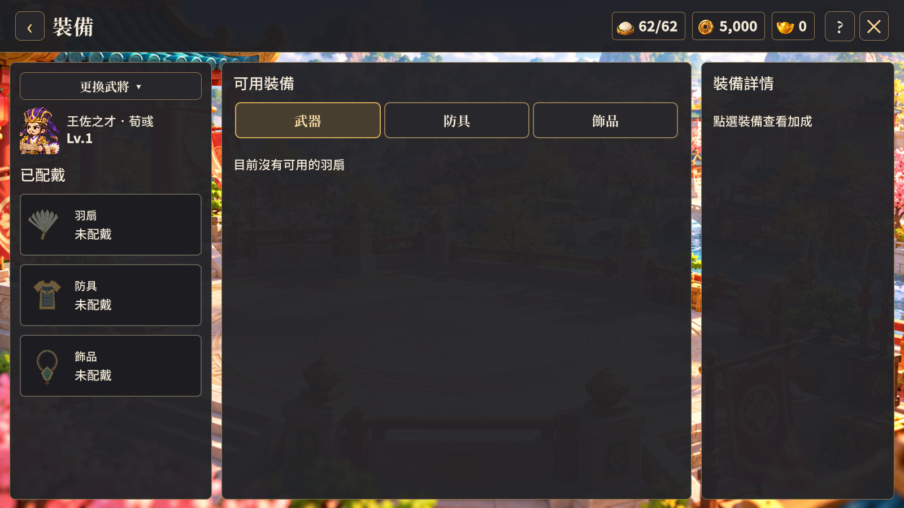

# 功能頁資源欄上緣留白驗收

日期：2026-10-10。

- 將原先只套用任務頁的頂欄尺寸移為共用 Unified UI 規則，套用地圖、武將、养成、裝備、招募、副本、世界首領、任務、商店、編隊與帳號頁。
- 頂欄高度 112 設計像素、上下內距 12 像素；資源框固定高度 60 像素，資源群組垂直置中且不壓縮。
- 美術驗證：檢視 1600×900 武將、商店及裝備頁實際截圖，資源框不接觸螢幕上緣，返回、標題、提示及關閉按鈕排列正常。
- 功能驗證：Unity 6000.3.25f1 Windows 建置成功，`tools/verify-unified-ui.ps1 -Width 1600 -Height 900` 產生 27 張截圖，執行期錯誤 0。新增逐頁檢查，資源框上下至少留有 12 設計像素，且保持在頂欄水平邊界內；新增裝備頁至同一驗收流程。
- 主城使用獨立資源列，登入頁沒有共用頂欄；本輪不調整其版面。既有 HomeLayout 的 last-child 警告仍保留。
- 沿用既有素材，沒有新增圖片或修改遊戲規則。

