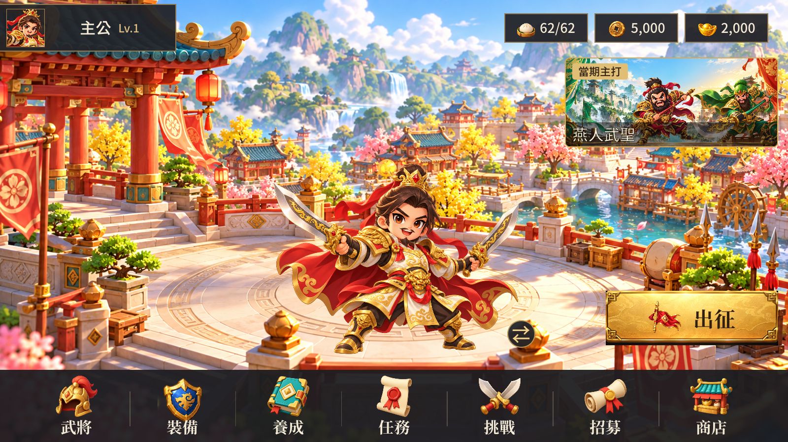
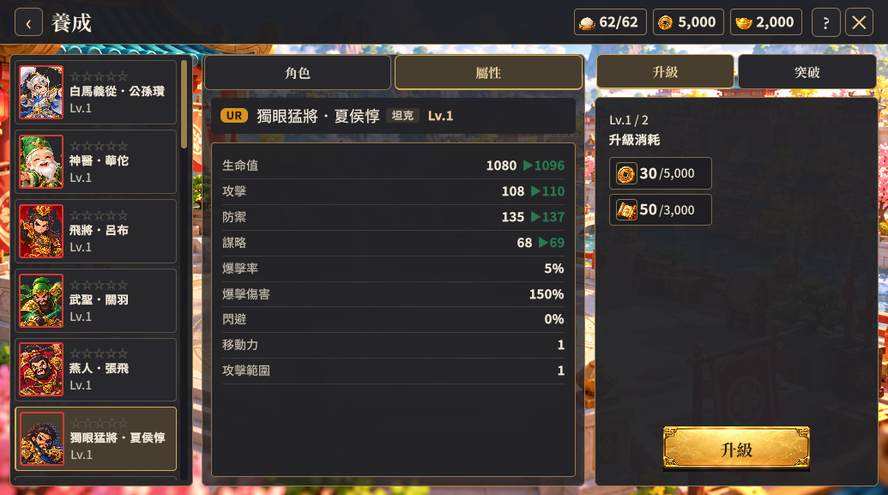

# 主頁中央角色與養成入口調整（2026-10-10）

依使用者要求移除養成頁的裝備按鈕，保留升級、突破兩個分頁；武將頁的已配戴資訊不受影響。養成操作提示改為從主頁裝備入口進入。

主頁展示角色改為水平置中，切換角色按鈕放在角色右下方。背景沿用專案既有 ChibiSkin/hall.png，中央庭院平台提供站立位置，取代原本俯瞰城鎮的 ChibiSkin/home.png。本次沒有生成或重繪背景、角色與圖示。

裝備盾牌沿用既有 ChibiSkin/armor.png，因內容留白與 HomeArt/Navigation 圖集不同，顯示框由 102 調為 124 個 UI 單位，並補償上下邊距，使可見圖案高度接近其他入口。七個入口順序維持武將、裝備、養成、任務、挑戰、招募、商店。

主頁資源框高度由 82 降為 72，圖示 58 降為 48，字級 36 降為 32；上列右側保留 48 個 UI 單位的留白。

## 驗證

- Unity Windows 建置成功。
- 最終 1600×900、1035×577 裝備／主頁流程各 13 張產物通過。增加主頁角色中心與視口中心一致、資源列右側留白、養成不存在裝備分頁的斷言。
- 養成 1035×577 八個產物通過：屬性、突破、星數、角色圖、模型非空及置中、恢復屬性、列表末尾。
- 沒有新增執行期或 USS 診斷；既有 HomeLayout last-child 警告仍在。
- 目視確認主頁角色與平台構圖、入口圖示大小、資源留白，以及養成的兩個分頁。沒有修改後端規則或其他協作者檔案。

