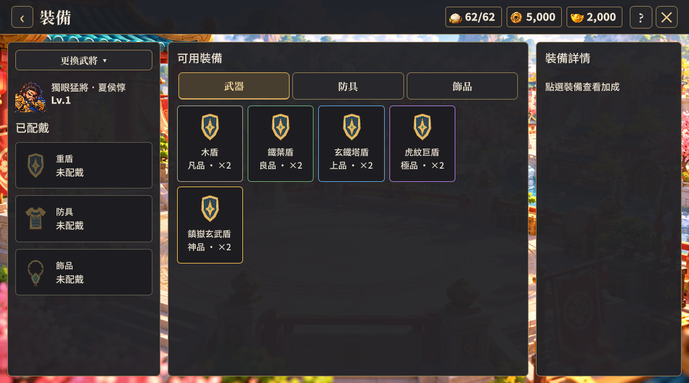
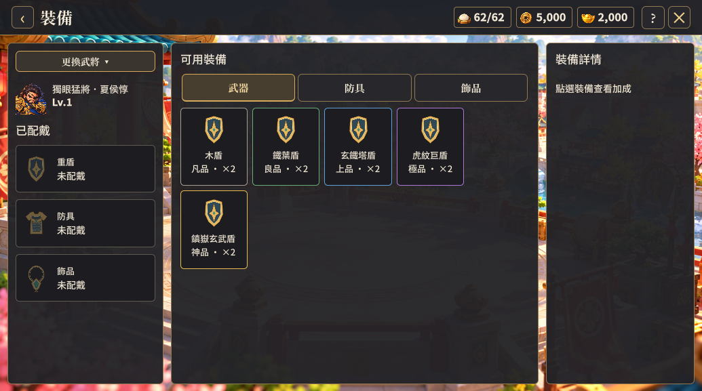

# 懸停尺寸與字級覆蓋修正（2026-10-10）

使用者再次回報「更換武將」懸停時變大。前階段只檢查 scale，漏掉共用樣式的懸停選擇器優先級：Polish 的 .meta-page .btn:hover 會蓋過裝備頁局部尺寸，恢復 min-height 84px、font-size 30px，與原本 58px、26px 不同。

本次掃描全部 USS 的懸停尺寸、內距、字級與邊框規則。在十二份樣式中，移除同一規則內與一般狀態重複的 hover／active 選擇器，讓尺寸持續使用一般狀態與局部元件設定，避免舊的共用尺寸因懸停增加優先級。獨立的懸停顏色、邊框提示規則保留。

## 驗證

- Unity Windows 建置通過。
- 1035×577、1600×900 各十張裝備頁產物通過。測試透過 Unity VisualElement 的 pseudoStates 啟用 Hover，逐一比較裝備頁 Button 的 worldBound 寬高及 resolvedStyle 字級，容許誤差 0.1，全部通過；這是樣式狀態驗證，並非作業系統滑鼠測試。
- 擷取「更換武將」一般與 Hover 狀態並目視比較，按鈕及下方肖像維持同一位置尺寸。
- 選人視窗、配戴、替換、卸下、分解及返回養成驗證通過。
- 同版建置另完成 26 張跨頁面畫面驗證；無新增執行期／樣式診斷。跨頁面驗證未逐一模擬每個按鈕 Hover。

前一階段的 scale 掃描紀錄僅證明 scale 宣告固定，不能據此推論所有懸停尺寸都不變；本次補上造成實際問題的高度與字級驗證。

