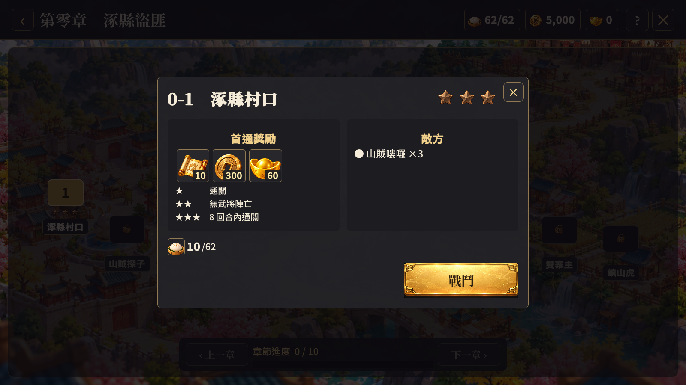
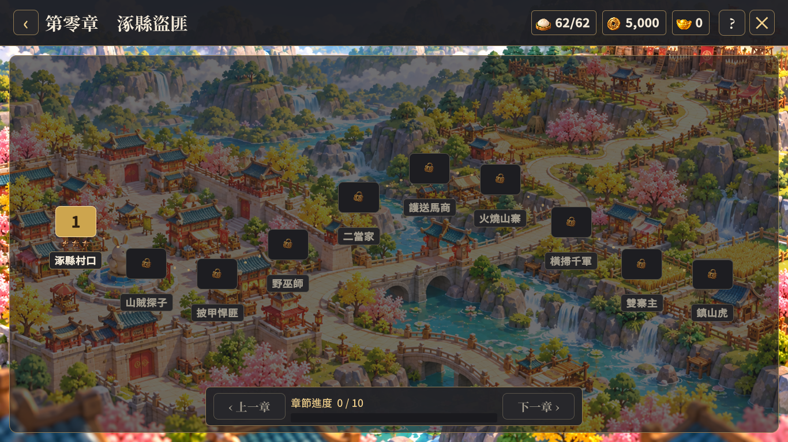

# 主線 UI 風格統一

日期：2026-10-10

## 視覺變更

- 對照已更新的素材副本頁，主線地圖加入炭黑半透明框景、細金邊與圓角，沿用專案既有地圖圖片。
- 關卡改為統一尺寸的方形圓角標記；可挑戰關卡以金底顯示，已通關關卡以綠色數字區分，未解鎖關卡顯示低亮度鎖頭與灰色名稱。
- 星級列固定高度，未解鎖關卡隱藏星級，避免解鎖後名稱位置跳動。
- 章節切換列採用相同的深色面板與按鈕，保留章節進度與既有難度切換。
- 關卡詳情的獎勵與敵方資訊放入雙欄區塊，調整標題、體力消耗和操作區的間距。

## 驗證

- 建置與功能檢查：Unity 6000.3.25f1 Windows 建置成功；`tools/verify-unified-ui.ps1` 在 1600×900、1366×768 各通過 31 張截圖驗證，執行期及新增樣式錯誤均為 0。既有 HomeLayout 的 last-child 警告仍在。
- 美術版面：檢視兩個尺寸的主線地圖與關卡詳情實際截圖；外框、十個關卡標記、名稱、進度列及詳情操作按鈕均無裁切或重疊。
- 驗收場景為第零章初始進度，可挑戰及鎖定狀態已實際檢視；已通關星級與困難模式沿用既有資料流程，本輪未另外操作通關或難度切換驗收。
- 本次只修改 UI 顯示與版面，未修改關卡規則、獎勵、掃蕩或解鎖判斷；未重新驗證後端戰鬥與掃蕩。
- 使用既有地圖、星級、鎖頭及按鈕素材，沒有新增生成圖片。

