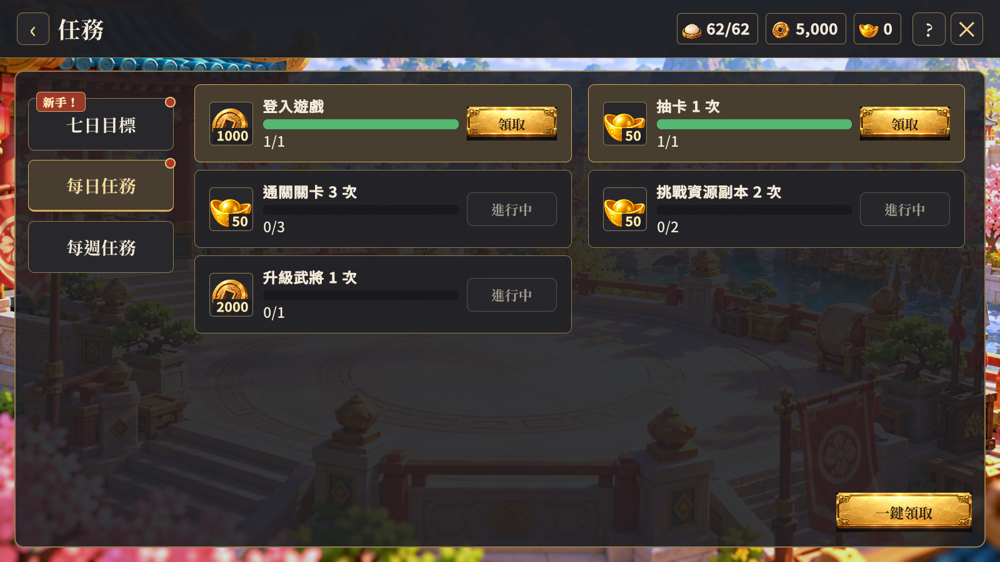
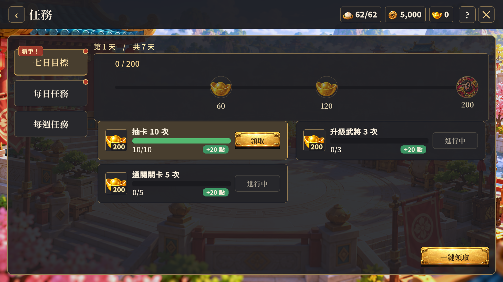

# 任務頁版面調整驗收

日期：2026-10-10。

## 調整內容

- 一鍵領取移至整體內容框右下角，獨立於清單且不隨清單捲動；移除上方重複的任務名稱列。
- 任務內容加入半透明深色背景、金色邊線與圓角外框，保留既有庭院背景素材。
- 七日目標排列在左側最上方，增加紅底金邊「新手！」提示；初次進入仍顯示每日任務。
- 任務頁頂欄高度調整為 112 設計像素，上下留白 12 像素，資源框高度 60 像素。
- 左側按鈕寬 280、高 100 設計像素，文字 34 像素。
- 沿用既有目前分頁的一鍵領取規則、可領取狀態與七日里程碑邏輯。

## 驗證結果

- 功能與建置：Unity 6000.3.25f1 Windows 建置成功；執行 `tools/verify-unified-ui.ps1 -Width 1600 -Height 900` 通過，產生 26 張截圖，執行期錯誤為 0。既有 HomeLayout 的 last-child 警告仍在，本次未修改該樣式。
- 美術版面：逐張檢視每日任務及七日目標 1600×900 實際截圖；外框、右下角領取按鈕、置頂新手提示、放大分頁按鈕及資源欄上緣留白符合本次要求。七日里程碑與任務卡沒有被截斷。
- 範圍：本輪為既有 UI 的版面修改，沒有新製作圖片或修改遊戲規則；未重新測試後端領取流程。

