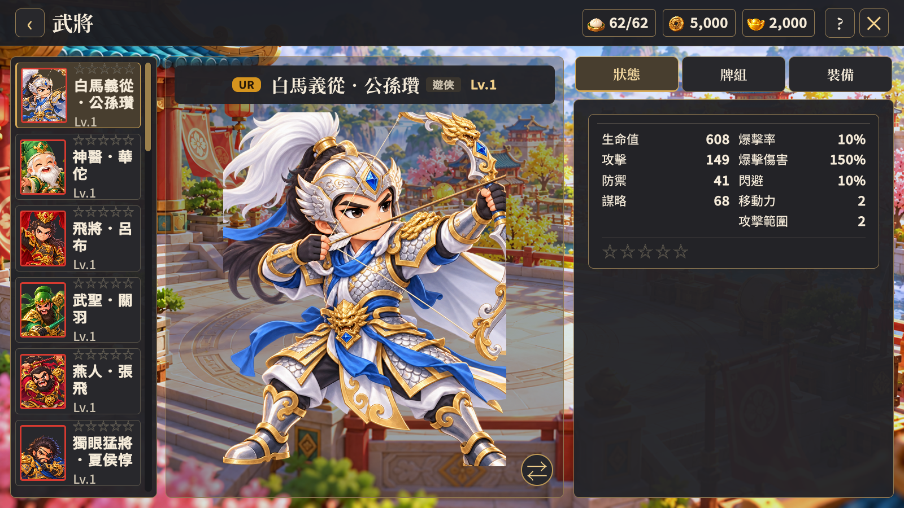
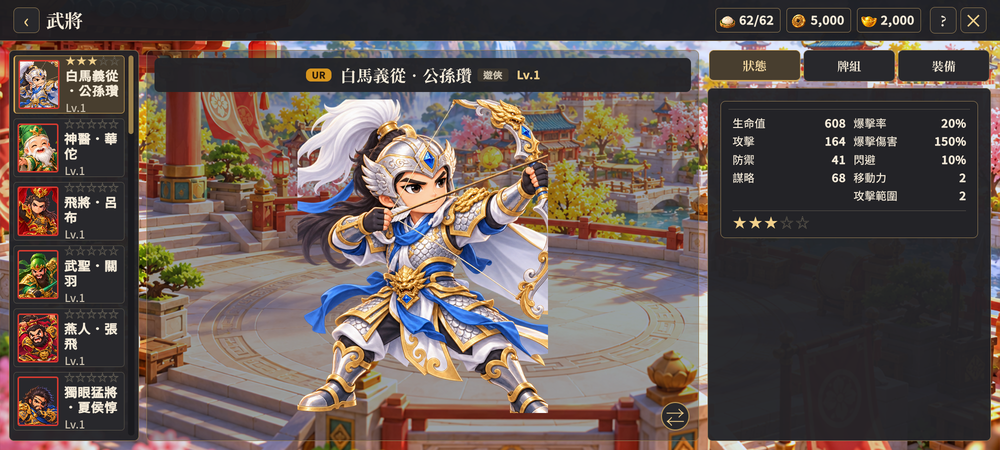

# 武將 UI 修正驗收（2026-10-10）

依使用者標註圖修正武將與共用養成頁，延用既有背景、立繪與字型，沒有新增或重新製作人物素材。

- 移除列表「麾下武將／已擁有」兩行標題。
- 頭像紅框代表 UR、黃框代表 SR、R 無框；列表移除重複稀有度文字，保留等級。
- 預設依 UR、SR、R 排序，同稀有度依 ID 排序，首次開啟選取第一位。
- 修復捲軸軌道及滑塊高度，列表可捲到最後一位。
- 星數依既有突破數顯示；0 突為五顆黑色空星，突破後逐顆填入金星。列表星數依後續要求放在人物名稱上方，狀態區使用同一套星色。
- 模型／立繪切換改為圓形雙向箭頭圖示，保留懸停提示。

## 驗證

執行 tools/verify-roster-ui.ps1，使用隔離專案建置與不持久化本機資料，注入全稀有度角色驗收。1600×900、2000×900 各 14 張，共 28 張；檢查兩頁的排序、框色、列表文字、星數位置與實際解析色、0／3／5 突、捲軸中段與底端、切換圖示事件及返回立繪。

兩尺寸建置／執行及上述結構檢查通過，無新增執行或樣式錯誤。既有 HomeLayout 的 last-child 偽類別警告分開記錄於 manifest。本次確認切換事件與 UI 容器，沒有將模型美術品質列為通過項目；沒有修改突破或其他遊戲規則。

完整截圖位於 build/roster-ui-review，各尺寸的驗收清單另存本目錄。

